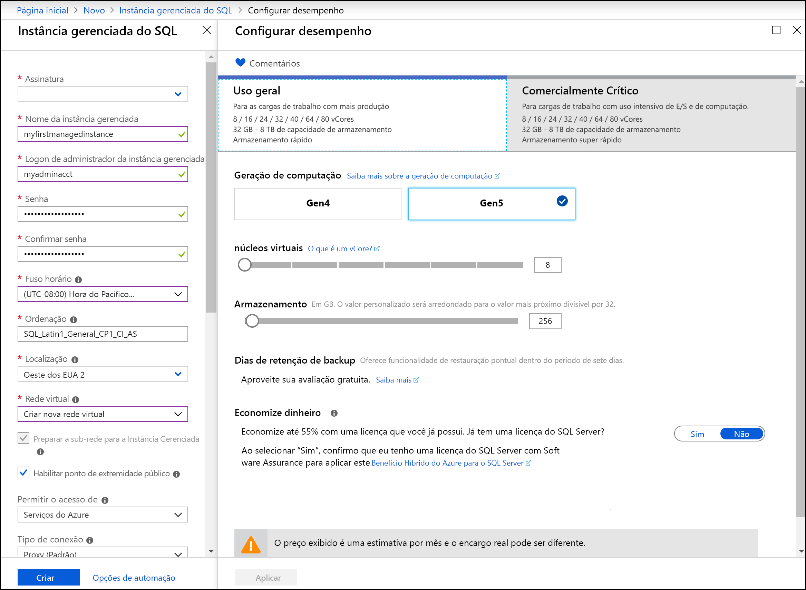
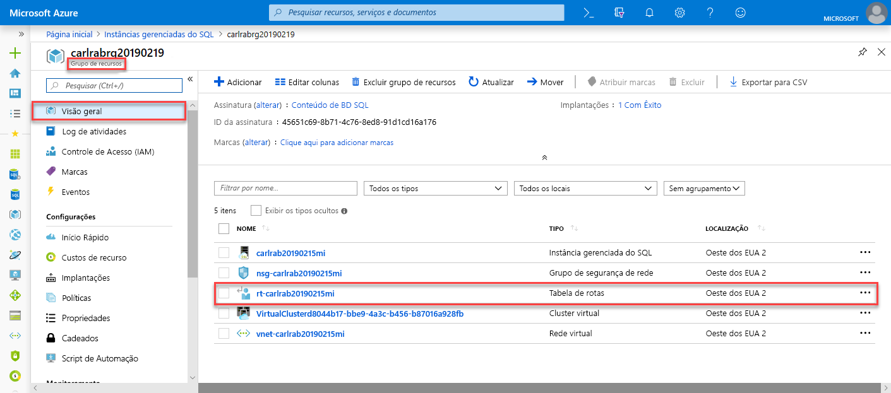
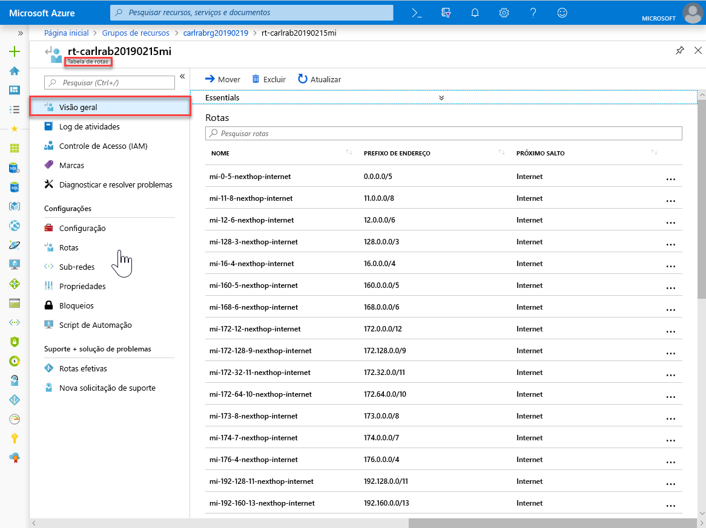
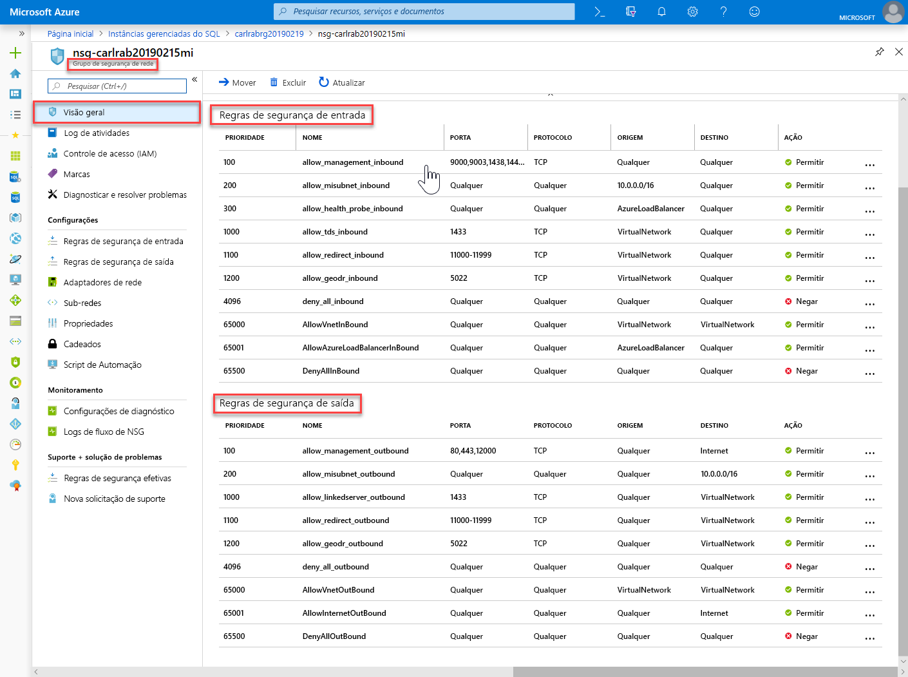

# Início Rápido: Criar uma instância gerenciada do Banco de Dados SQL do Azure

Este Início Rápido orienta sobre como criar uma [instância gerenciada](sql-database-managed-instance.md) do Banco de Dados SQL do Azure no portal do Azure.

Se você não tiver uma assinatura do Azure, [crie uma conta gratuita](https://azure.microsoft.com/free/) antes de começar.

## Entre no Portal do Azure

Entre no [Portal do Azure](https://portal.azure.com/).

## Criar uma instância gerenciada

As etapas a seguir mostram como criar uma instância gerenciada.

1. Escolha **Criar um recurso** no canto superior esquerdo do portal do Azure.
2. Localize **instância gerenciada** e selecione **Instância Gerenciada do SQL do Azure**.
3. Selecione **Criar**.

   

4. Preencha o formulário de **instância gerenciada do SQL** com as informações solicitadas, usando as informações da tabela a seguir:

   | Configuração| Valor sugerido | DESCRIÇÃO |
   | ------ | --------------- | ----------- |
   | **Assinatura** | Sua assinatura | Uma assinatura na qual você tem permissão para criar novos recursos |
   |**Nome da Instância Gerenciada**|Qualquer nome válido|Para ver os nomes válidos, consulte [regras e restrições de nomenclatura](https://docs.microsoft.com/azure/architecture/best-practices/naming-conventions).|
   |**Logon de administrador da Instância Gerenciada**|Um nome de usuário válido|Para ver os nomes válidos, consulte [regras e restrições de nomenclatura](https://docs.microsoft.com/azure/architecture/best-practices/naming-conventions). Não use "serveradmin", que é uma função de nível de servidor reservada.|
   |**Senha**|Qualquer senha válida|A senha deve ter no mínimo 16 caracteres e atender a [requisitos de complexidade definidos](../virtual-machines/windows/faq.md#what-are-the-password-requirements-when-creating-a-vm).|
   |**Ordenação**|A ordenação que você deseja usar para a instância gerenciada|Se estiver migrando bancos de dados do SQL Server, verifique a ordenação de origem usando `SELECT SERVERPROPERTY(N'Collation')` e use esse valor. Para saber mais sobre ordenações, confira [ordenações de nível de servidor](https://docs.microsoft.com/sql/relational-databases/collations/set-or-change-the-server-collation).|
   |**Localidade**|O local no qual você deseja criar a instância gerenciada|Para obter mais informações sobre as regiões, confira [Regiões do Azure](https://azure.microsoft.com/regions/).|
   |**Rede virtual**|Selecione a **Criar nova rede virtual** ou uma rede virtual e uma sub-rede válidas.| Se uma rede/sub-rede estiver esmaecida, ela deverá ser [modificada para cumprir os requisitos de rede](sql-database-managed-instance-configure-vnet-subnet.md) antes de selecioná-la como um destino para a nova instância gerenciada. Para saber mais sobre os requisitos para configurar o ambiente de rede para uma instância gerenciada, confira [configurar uma VNet para uma instância gerenciada](sql-database-managed-instance-connectivity-architecture.md). |
   |**Grupo de recursos**|Um grupo de recursos novo ou existente|Para ver os nomes do grupo de recursos válidos, consulte [Regras e restrições de nomenclatura](https://docs.microsoft.com/azure/architecture/best-practices/naming-conventions).|

   

5. Para usar a instância gerenciada como um grupo de failover de instância secundário, selecione o check-out e especifique a instância gerenciada do DnsAzurePartner. Esse recurso está em versão prévia e não é mostrado na captura de tela que acompanha este artigo.
6. Selecione **Tipo de preço** para dimensionar os recursos de computação e armazenamento e revisar as opções de tipo de preço. O tipo de preço de Uso Geral com 32 GB de memória e 16 vCores é o valor padrão.
7. Use os controles deslizantes ou as caixas de texto para especificar a quantidade de armazenamento e o número de núcleos virtuais.
8. Ao concluir, escolha **Aplicar** para salvar sua seleção.  
9. Selecione **Criar** para implantar a instância gerenciada.
10. Selecione o ícone **Notificações** para exibir o status da implantação.

    

11. Selecione **Implantação em andamento** para abrir a janela de instância gerenciada e monitorar melhor o progresso da implantação.

> [!IMPORTANT]
> Para a primeira instância em uma sub-rede, o tempo de implantação é normalmente muito maior do em instâncias subsequentes. Não cancele a operação de implantação porque ela dura mais que o esperado. A criação da segunda instância gerenciada na sub-rede levará apenas alguns minutos.

## Examinar os recursos e recuperar o nome do servidor totalmente qualificado

Depois que a implantação for concluída com êxito, examine os recursos criados e recupere o nome do servidor totalmente qualificado para uso em inícios rápidos posteriores.

1. Abra o grupo de recursos para a instância gerenciada e exiba seus recursos que foram criados para você no início rápido [criar uma instância gerenciada](#create-a-managed-instance).

   

2. Selecione a tabela de rotas para examinar a tabela de UDR (rota definida pelo usuário) que foi criada para você.

   

3. Na tabela de rotas, examine as entradas para rotear o tráfego de/para a rede virtual de instância gerenciada. Se você estiver criando ou configurando a tabela de rotas manualmente, certifique-se de criar essas entradas na tabela de rotas.

   

4. Retorne ao grupo de recursos e selecione o grupo de segurança de rede para examinar as regras de segurança.

   

5. Examine as regras de segurança de entrada e saída.

   

6. Retorne ao grupo de recursos e selecione sua instância gerenciada.

   

7. Na guia **Visão geral**, localize a propriedade **Host** e copie o endereço de host totalmente qualificado da instância gerenciada a fim de usá-lo no próximo início rápido.

   

   O nome será semelhante a **nome_do_seu_computador.a1b2c3d4e5f6.database.windows.net**.

## Próximas etapas

- Para saber mais sobre como se conectar a uma instância gerenciada, confira:
  - Para obter uma visão geral das opções de conexão para aplicativos, confira [conectar seus aplicativos à instância gerenciada](sql-database-managed-instance-connect-app.md).
  - Para ver um início rápido que mostra como se conectar a uma instância gerenciada em uma máquina virtual do Azure, confira [Configurar uma conexão de máquina virtual do Azure](sql-database-managed-instance-configure-vm.md).
  - Para ver um início rápido que mostra como se conectar a uma instância gerenciada de um computador cliente local usando uma conexão ponto a site, confira [Configurar uma conexão ponto a site](sql-database-managed-instance-configure-p2s.md).
- Para restaurar um banco de dados do SQL Server existente do local para uma Instância Gerenciada, use o [DMS (Serviço de Migração de Banco de Dados do Azure) para realizar a migração](../dms/tutorial-sql-server-to-managed-instance.md) para restaurar de um arquivo de backup do banco de dados ou o [comando T-SQL RESTORE](sql-database-managed-instance-get-started-restore.md) para restaurar de um arquivo de backup do banco de dados.
- Para monitoramento avançado do desempenho de banco de dados de instância gerenciada com inteligência de solução de problemas, confira [Monitorar Banco de Dados SQL do Azure usando a Análise de SQL do Azure](../azure-monitor/insights/azure-sql.md)
