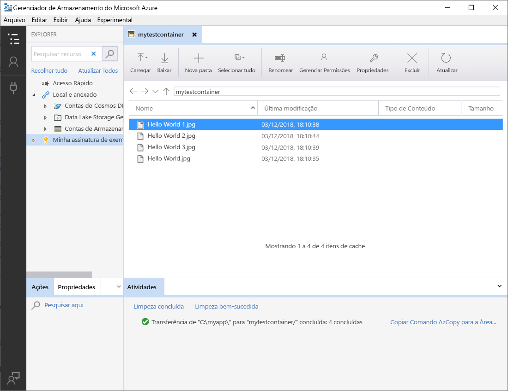

# Início Rápido: usar o Gerenciador de Armazenamento do Azure para gerenciar dados em uma conta do Azure Data Lake Storage Gen2

Neste início rápido, você aprenderá como usar o [Gerenciador de Armazenamento do Azure](https://azure.microsoft.com/features/storage-explorer/) para criar um diretório e um blob. Em seguida, você aprenderá a baixar o blob para seu computador local e exibir todos os blobs em um diretório. Você também aprenderá como criar um instantâneo de um blob, gerenciar as políticas de acesso do diretório e criar uma assinatura de acesso compartilhado.

## Pré-requisitos

[!INCLUDE [storage-quickstart-prereq-include](../../../includes/storage-quickstart-prereq-include.md)]

Este início rápido requer que você instale o Gerenciador de Armazenamento do Azure. Para instalar o Gerenciador de Armazenamento do Azure para Windows, Macintosh ou Linux, confira o [Gerenciador de Armazenamento do Azure](https://azure.microsoft.com/features/storage-explorer/).

## Conectar-se ao Gerenciador de Armazenamento

Na primeira inicialização, é exibida a janela **Gerenciador de Armazenamento do Microsoft Azure – Conectar**. Embora o Gerenciador de Armazenamento forneça várias maneiras de se conectar às contas de armazenamento, apenas uma maneira tem suporte atualmente para gerenciar ACLs.

|Tarefa|Finalidade|
|---|---|
|Adicionar uma conta do Azure | Redireciona você para a página de logon das suas organizações para autenticação no Azure. Atualmente, esse será o método de autenticação com suporte apenas se você quiser gerenciar e definir ACLs. |

Selecione **Adicionar uma Conta do Azure** e clique em **Entrar...**. Siga os avisos da tela para entrar na sua conta do Azure.

Ao concluir a conexão, o Gerenciador de Armazenamento do Azure carrega exibindo a guia **Explorer**. Essa exibição lhe dá informações de todas suas contas de armazenamento do Azure e do armazenamento local, configuradas por meio do [Emulador de Armazenamento do Azure](../common/storage-use-emulator.md?toc=%2fazure%2fstorage%2fblobs%2ftoc.json), das contas do [Cosmos DB](../../cosmos-db/storage-explorer.md?toc=%2fazure%2fstorage%2fblobs%2ftoc.json) ou dos ambientes do [Azure Stack](/azure-stack/user/azure-stack-storage-connect-se?toc=%2fazure%2fstorage%2fblobs%2ftoc.json).

## Criar um sistema de arquivos

Os blobs são sempre carregados em um diretório. Isso permite que você organize grupos de blobs da mesma forma que organiza os arquivos em pastas no seu computador.

Para criar um diretório, expanda a conta de armazenamento criada por você na etapa a seguir. Selecione **Contêiner de blobs**, clique com o botão direito do mouse e selecione **Criar contêiner de Blobs**. Insira o nome do sistema de arquivos. Ao concluir, pressione **Enter** para criar o sistema de arquivos. Após a criação com êxito do diretório de blobs, ele será exibido na pasta **Contêiner de blobs** da conta de armazenamento selecionada.

## Carregar blobs para o diretório

O Armazenamento de Blobs dá suporte a blobs de blocos, blobs de acréscimo e blobs de páginas. Os arquivos VHD usados para auxiliar VMs IaaS são blobs de páginas. Os blobs de acréscimo são usados para registro em log, como quando você quer gravar em um arquivo e depois adicionar mais informações. A maioria dos arquivos armazenados no Armazenamento de Blobs são blobs de blocos.

Na faixa de opções de diretório, selecione **Carregar**. Essa operação lhe dá a opção de carregar um arquivo ou uma pasta.

Escolha os arquivos ou pastas a serem carregados. Selecione o **tipo de blob**. Opções aceitáveis são **Acrescentar**, **Página** ou blob de **Blocos**.

Se for carregar um arquivo. vhd ou. vhdx, escolha **Carregar arquivos .vhd/.vhdx como blobs de página (recomendado)**.

No campo **Carregar para a pasta (opcional)**, escolha um nome de pasta para armazenar os arquivos ou pastas em uma pasta sob o diretório. Se nenhuma pasta for escolhida, os arquivos serão carregados diretamente no diretório.

Ao selecionar **OK**, os arquivos selecionados são colocados na fila para carregamento e cada arquivo é carregado. Quando o carregamento for concluído, os resultados são mostrados na janela **Atividades**.

## Exibir blobs em um diretório

No aplicativo **Gerenciador de Armazenamento do Azure**, selecione um diretório em uma conta de armazenamento. O painel principal mostra uma lista dos blobs no diretório selecionado.

## Baixar blobs

Para baixa blobs usando o **Gerenciador de Armazenamento do Azure**, com um blob selecionado, selecione **Baixar** na faixa de opções. Uma caixa de diálogo é aberta, na qual é possível inserir um nome de arquivo. Selecione **Salvar** para iniciar o download de um blob para a localização local.

## Próximas etapas

Neste guia de início rápido, você aprendeu a transferir arquivos entre um disco local e o armazenamento de Blobs do Azure usando o **Gerenciador de Armazenamento do Azure**. Para saber mais sobre como definir as ACLs em seus arquivos e diretórios, siga para as nossas instruções sobre o assunto.

> [!div class="nextstepaction"]
> [Como definir as ACLs em arquivos e diretórios](data-lake-storage-how-to-set-permissions-storage-explorer.md)
