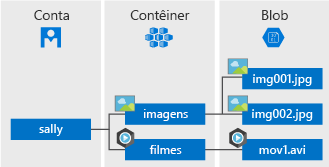

# <a name="introduction-to-azure-blob-storage"></a>Introdução ao armazenamento de Blobs do Azure

[!INCLUDE [storage-blob-concepts-include](../../../includes/storage-blob-concepts-include.md)]

## <a name="blob-storage-resources"></a>Recursos de Armazenamento de Blobs

O Armazenamento de Blobs oferece três tipos de recursos:

- A **conta de armazenamento**. 
- Um **contêiner** na conta de armazenamento
- Um **blob** em um contêiner 

O diagrama a seguir mostra a relação entre esses recursos.



### <a name="storage-accounts"></a>Contas de armazenamento

Uma conta de armazenamento fornece um namespace exclusivo no Azure para seus dados. Todos os objetos armazenados no Armazenamento do Azure têm um endereço que inclui o nome exclusivo da conta. A combinação do nome da conta e do ponto de extremidade do blob do Armazenamento do Azure forma endereço básico dos objetos na sua conta de armazenamento.

Por exemplo, se a conta de armazenamento se chamar *mystorageaccount*, o ponto de extremidade padrão para Armazenamento de Blobs será:

```
http://mystorageaccount.blob.core.windows.net 
```

Para criar uma conta de armazenamento, consulte [Criar uma conta de armazenamento](../common/storage-quickstart-create-account.md). Para saber mais sobre as contas de armazenamento, confira [Visão geral da conta de Armazenamento do Microsoft Azure](../common/storage-account-overview.md?toc=%2fazure%2fstorage%2fblobs%2ftoc.json).

### <a name="containers"></a>Contêineres

Um contêiner organiza um conjunto de blobs, semelhantes a um diretório em um sistema de arquivos. Uma conta de armazenamento pode incluir um número ilimitado de contêineres e um contêiner pode armazenar um número ilimitado de blobs. 

  > [!NOTE]
  > O nome do contêiner deve estar em letras minúsculas. Para saber mais sobre como dar nomes a contêineres, confira [Nomenclatura e referência de contêineres, blobs e metadados](https://docs.microsoft.com/rest/api/storageservices/Naming-and-Referencing-Containers--Blobs--and-Metadata).

### <a name="blobs"></a>Blobs
 
O Armazenamento do Azure dá suporte a três tipos de blobs:

* **Blobs de bloco** armazenam texto e dados binários, até aproximadamente 4,7 TB. Blobs de bloco são compostos de blocos de dados que podem ser gerenciados individualmente.
* **Blobs de acréscimo** são compostos de blocos, como blobs de blocos, mas são otimizados para operações de acréscimo. Blobs de acréscimo são ideais para cenários como o registro de dados das máquinas virtuais.
* **Blobs de Páginas** armazenam arquivos de acesso aleatório de até 8 TB. Os arquivos de VHD (disco rígido virtual) do Armazenamento de Blobs de página servem como discos para máquinas virtuais do Azure. Para saber mais sobre blobs de páginas, confira [Visão geral dos blobs de páginas do Azure](storage-blob-pageblob-overview.md)

Para obter mais informações sobre os diferentes tipos de blobs, confira [Compreendendo os Blobs de Blocos, Blobs de Acréscimo e Blobs de Página](https://docs.microsoft.com/rest/api/storageservices/understanding-block-blobs--append-blobs--and-page-blobs).

## <a name="move-data-to-blob-storage"></a>Mover dados para o Armazenamento de Blobs

Existem várias soluções para migrar dados existente para o Armazenamento de Blobs:

- **AzCopy** é uma ferramenta de linha de comando fácil de usar para Windows e Linux que copia dados de e para o Armazenamento de Blobs entre contêineres ou entre contas de armazenamento. Para obter mais informações sobre o AzCopy, confira [Transferir dados com o AzCopy v10 (Versão Prévia)](../common/storage-use-azcopy-v10.md). 
- A **biblioteca de Movimentação de Dados do Armazenamento do Azure** é uma biblioteca .NET para mover dados entre os serviços de Armazenamento do Azure. O utilitário AzCopy é criado com a biblioteca de Movimentação de Dados. Para obter mais informações, confira a [documentação de referência](https://docs.microsoft.com/dotnet/api/microsoft.windowsazure.storage.datamovement) para a biblioteca de Movimentação de Dados. 
- O **Azure Data Factory** dá suporte à cópia de dados de e para o Armazenamento de Blobs usando a chave de conta, a assinatura de acesso compartilhado, a entidade de serviço ou as identidades gerenciadas para as autenticações de recursos do Azure. Para obter mais informações, confira [Copiar dados de ou para o Armazenamento de Blobs do Azure usando o Azure Data Factory](https://docs.microsoft.com/azure/data-factory/connector-azure-blob-storage?toc=%2fazure%2fstorage%2fblobs%2ftoc.json). 
- O **Blobfuse** é um driver de sistema de arquivos virtual para o Armazenamento de Blobs do Azure. Você pode usar o blobfuse para acessar seus dados de blob de blocos existentes em sua conta de armazenamento por meio do sistema de arquivos Linux. Para obter mais informações, confira [Como montar o Armazenamento de Blobs como um sistema de arquivos com blobfuse](storage-how-to-mount-container-linux.md).
- **Azure Data Box Disk** é um serviço para transferir dados locais para o Armazenamento de Blobs quando grandes conjuntos de dados ou restrições de rede tornam o upload de dados com fio irreal. Você pode usar o [Azure Data Box Disk](../../databox/data-box-disk-overview.md) para solicitar SSDs (unidades de estado sólido) à Microsoft. Você pode copiar seus dados para os discos e enviá-los à Microsoft para serem carregados no armazenamento de blobs.
- O **serviço de Importação/Exportação do Azure** fornece uma maneira de exportar grandes quantidades de dados de sua conta de armazenamento para discos rígidos que você fornece e que a Microsoft então envia de volta a você com seus dados. Para saber mais, confira [Usar o serviço de Importação/Exportação do Microsoft Azure para transferir dados ao Armazenamento de Blobs](../common/storage-import-export-service.md).

## <a name="next-steps"></a>Próximas etapas

* [Criar uma conta de armazenamento](../common/storage-create-storage-account.md?toc=%2fazure%2fstorage%2fblobs%2ftoc.json)
* [Metas de desempenho e escalabilidade do Armazenamento do Azure](../common/storage-scalability-targets.md)
