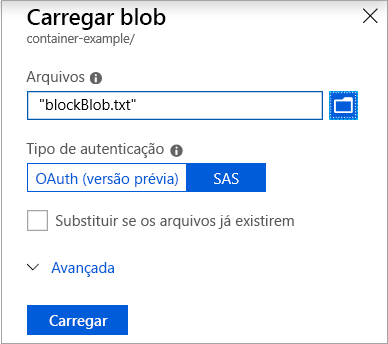

# Início rápido: Carregar, baixar e listar blobs usando o portal do Azure

Neste guia de início rápido, você aprenderá a usar o [portal do Azure](https://portal.azure.com/) para criar um contêiner no Armazenamento do Azure e a carregar e baixar blobs de blocos nesse contêiner.

## pré-requisitos

Se você não tiver uma assinatura do Azure, crie uma [conta gratuita](https://azure.microsoft.com/free/?WT.mc_id=A261C142F) antes de começar.

[!INCLUDE [storage-quickstart-tutorial-create-account-portal](../../../includes/storage-quickstart-tutorial-create-account-portal.md)]

## Criar um contêiner

Para criar um contêiner no portal do Azure, siga estas etapas:

1. Navegue até sua nova conta de armazenamento no portal do Azure.
2. No menu à esquerda da conta de armazenamento, role até a seção **Serviço de Blobs** e selecione **Procurar Blobs**.
3. Clique no botão **Adicionar Contêiner**.
4. Digite um nome para seu novo contêiner. O nome do contêiner deve estar em caixa baixa, começar com uma letra ou número e pode conter apenas letras, números e o caractere traço (-). Consulte [Naming and Referencing Containers, Blobs, and Metadata](https://docs.microsoft.com/rest/api/storageservices/naming-and-referencing-containers--blobs--and-metadata) (Nomenclatura e referência de contêineres, blobs e metadados) para obter mais informações sobre nomes de contêiner e de blobs.
5. Defina o nível de acesso público ao contêiner. O nível padrão é **Privado (sem acesso anônimo)**.
6. Clique em **OK** para criar o contêiner.

    

## Carregar um blob de blocos

Blobs de bloco consistem em blocos de dados montados para criar um blob. A maioria dos cenários que usa o Armazenamento de blobs emprega blobs de blocos. Os blobs de blocos são ideais para armazenar texto e dados binários na nuvem, como arquivos, imagens e vídeos. Este guia de início rápido mostra como trabalhar com blobs de blocos. 

Para carregar um blob de blocos para seu novo contêiner no portal do Azure, siga estas etapas:

1. No portal do Azure, navegue até o contêiner que você criou na seção anterior.
2. Selecione o contêiner para mostrar uma lista de blobs que ele contém. Nesse caso, uma vez que você criou um novo contêiner, ele ainda não contém nenhum blob.
3. Clique no botão **Carregar** para carregar um blob no contêiner.
4. Procure seu sistema de arquivos local para encontrar um arquivo a ser carregado como um blob de blocos e depois clique em **Carregar**.
     
    

5. Carregue quantos blobs desejar usando essa maneira. Você verá que os novos blobs agora estão listados dentro do contêiner.

    

## Baixar um blob de blocos

Você pode baixar um blob de blocos para exibir no navegador ou salvar em seu sistema de arquivos local. Para baixar um blob de blocos, siga estas etapas:

1. Navegue até a lista de blobs que você carregou na seção anterior. 
2. Selecione o blob a ser baixado.
3. Clique com botão direito do mouse no botão **Mais** (**...**) e selecione **Baixar**. 

## Limpar recursos

Para remover os recursos criados neste guia de início rápido, você pode simplesmente excluir o contêiner. Todos os blobs no contêiner também serão excluídos.

Para excluir o contêiner:

1. No portal do Azure, navegue até a lista de contêineres na sua conta de armazenamento.
2. Selecione o contêiner a ser excluído.
3. Clique com botão direito do mouse no botão **Mais** (**...**) e selecione **Excluir**.
4. Confirme que você realmente deseja excluir o contêiner.

       

## Próximas etapas

Nesse guia de início rápido, você aprendeu a transferir arquivos entre o disco local e Armazenamento de Blobs do Azure usando o .NET. Para saber mais sobre como trabalhar com o Armazenamento de Blobs, prossiga para as instruções do Armazenamento de Blobs.

> [!div class="nextstepaction"]
> [Instruções de operações do Armazenamento de Blobs](storage-dotnet-how-to-use-blobs.md)

