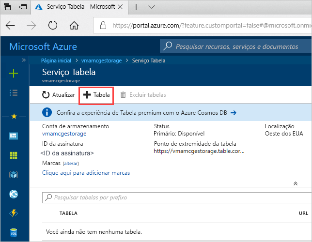

# Início Rápido: Criar uma tabela do Armazenamento do Azure no Portal do Azure 

Este guia de início rápido mostra como criar tabelas e entidades no Portal do Azure baseado na Web. Este início rápido também mostra como criar uma conta de Armazenamento do Azure.

[!INCLUDE [quickstarts-free-trial-note](../../../includes/quickstarts-free-trial-note.md)]

## Pré-requisitos

Para concluir este início rápido, primeiro crie uma conta de armazenamento do Azure no [portal do Azure](https://portal.azure.com/#create/Microsoft.StorageAccount-ARM). Para obter ajuda sobre como criar a conta, confira [Criar uma conta de armazenamento](../common/storage-quickstart-create-account.md).

## Adicionar uma tabela

Agora, você pode usar o serviço Tabela no Portal do Azure para criar uma tabela.

1. Clique em Visão Geral > Tabelas.

   

2. Clique em **+ Tabela**.

   

3. Digite um nome para a sua tabela na caixa **Nome da tabela** e, em seguida, clique em **OK**. 

   

## Próximas etapas

- [Diretrizes de design da tabela](table-storage-design-guidelines.md)
