# <a name="quickstart-create-an-azure-stream-analytics-cloud-job-in-visual-studio-code-preview"></a>Início Rápido: Criar um trabalho em nuvem do Azure Stream Analytics no Visual Studio Code (versão prévia)

Este guia de início rápido mostra como criar e executar um trabalho do Stream Analytics usando a extensão do Azure Stream Analytics para o Visual Studio Code. O trabalho de exemplo lê dados de streaming de um dispositivo Hub IoT. Você definirá um trabalho que calcula a temperatura média quando ela ultrapassa 27° e que grava os eventos de saída resultantes em um novo arquivo no armazenamento de blobs.

## <a name="before-you-begin"></a>Antes de começar

* Se você não tiver uma assinatura do Azure, crie uma [conta gratuita](https://azure.microsoft.com/free/).

* Entre no [Portal do Azure](https://portal.azure.com/).

* Instale o [Visual Studio Code](https://code.visualstudio.com/).

## <a name="install-the-azure-stream-analytics-extension"></a>Instale a extensão do Azure Stream Analytics

1. Abra o Visual Studio Code.

2. Em **Extensões** no painel esquerdo, pesquise por **Stream Analytics** e selecione **Instalar** na extensão do **Azure Stream Analytics**.

3. Quando a extensão estiver instalada, verifique se **Ferramentas do Azure Stream Analytics** está visível nas **Extensões Habilitadas**.

   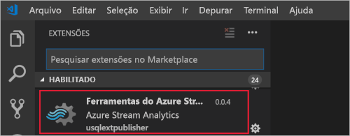

## <a name="activate-the-azure-stream-analytics-extension"></a>Ative a extensão do Azure Stream Analytics

1. Selecione o ícone **Azure** na barra de atividade do VS Code. **Stream Analytics** estará visível na barra lateral. Em **Stream Analytics**, selecione **Entrar no Azure**. 

   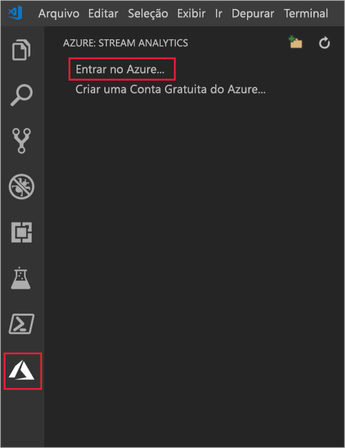

2. Quando você estiver conectado, o nome da conta do Azure aparecerá na barra de status no canto inferior esquerdo da janela do VS Code.

> [!NOTE]
> As ferramentas do Azure Stream Analytics serão conectadas automaticamente na próxima vez se você não desconectar. Caso sua conta tenha autenticação de dois fatores habilitada, é recomendável o uso da autenticação por telefone em vez de usar um PIN.
> Se você tiver problemas na listagem de recursos, saia e entre novamente. Para sair, insira o comando `Azure: Sign Out`.

## <a name="prepare-the-input-data"></a>Preparar os dados de entrada

Antes de definir o trabalho do Stream Analytics, você deve preparar os dados, que serão posteriormente configurados como a entrada do trabalho. Para preparar os dados de entrada exigidos pelo trabalho, complete as seguintes etapas:

1. Entre no [Portal do Azure](https://portal.azure.com/).

2. Selecione **Criar um recurso** > **Internet das Coisas** > **Hub IoT**.

3. No painel do **Hub IoT**, insira as seguintes informações:
   
   |**Configuração**  |**Valor sugerido**  |**Descrição**  |
   |---------|---------|---------|
   |Assinatura  | \<Sua assinatura\> |  Selecione a assinatura do Azure que você deseja usar. |
   |Grupo de recursos   |   asaquickstart-resourcegroup  |   Selecione **Criar Novo** e insira um novo nome de grupo de recursos para a conta. |
   |Região  |  \<Selecione a região mais próxima de seus usuários\> | Selecione uma localização geográfica na qual você possa hospedar o Hub IoT. Use a localização mais próxima dos usuários. |
   |Nome do Hub IoT  | MyASAIoTHub  |   Selecione um nome para o Hub IoT.   |

   

4. Selecione **Avançar: Definir o tamanho e a escala**.

5. Escolha **Tipo de preço e escala**. Para este início rápido, selecione a camada **F1 – Gratuita**, caso ela ainda esteja disponível em sua assinatura. Se a camada gratuita não estiver disponível, escolha a camada mais baixa disponível. Para obter mais informações, consulte [Preço do Hub IoT](https://azure.microsoft.com/pricing/details/iot-hub/).

   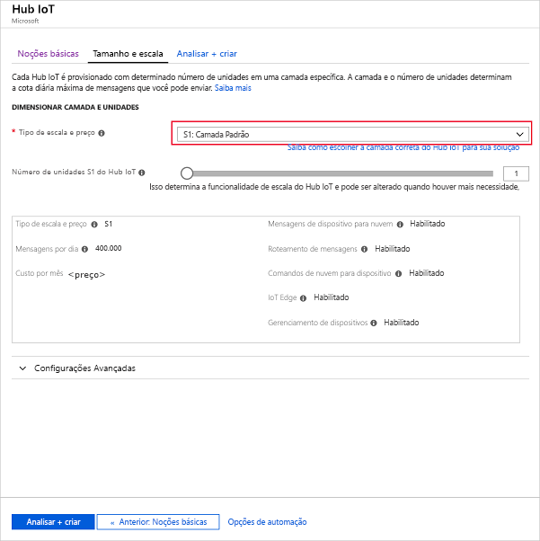

6. Selecione **Examinar + criar**. Examine as informações do Hub IoT e clique em **Criar**. A criação do Hub IoT pode levar alguns minutos. Você pode monitorar o progresso no painel **Notificações**.

7. No menu de navegação do Hub IoT, clique em **Adicionar** em **Dispositivos IoT**. Adicione uma **ID do dispositivo** e clique em **Salvar**.

   

8. Assim que o dispositivo tiver sido criado, abra-o na lista **Dispositivos IoT**. Copie a **Cadeia de conexão – chave primária** e salve-a em um bloco de notas para uso futuro.

   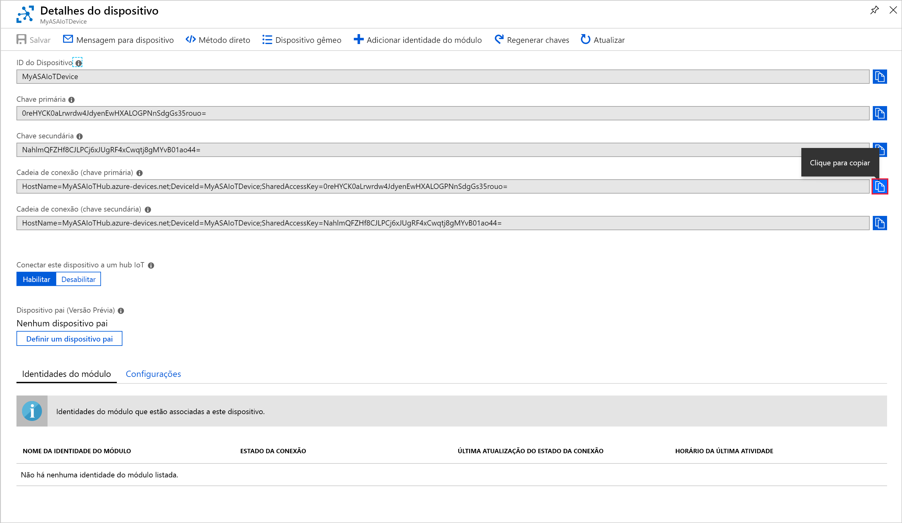

## <a name="create-blob-storage"></a>Criar o armazenamento de blobs

1. No canto superior esquerdo do portal do Azure, selecione **Criar um recurso** > **Armazenamento** > **Conta de armazenamento**.

2. No painel **Criar conta de armazenamento**, insira um nome para a conta de armazenamento, um local e um grupo de recursos. Escolha o mesmo local e grupo de recursos do Hub IoT criado. Clique em **Revisar + criar** para criar a conta.

   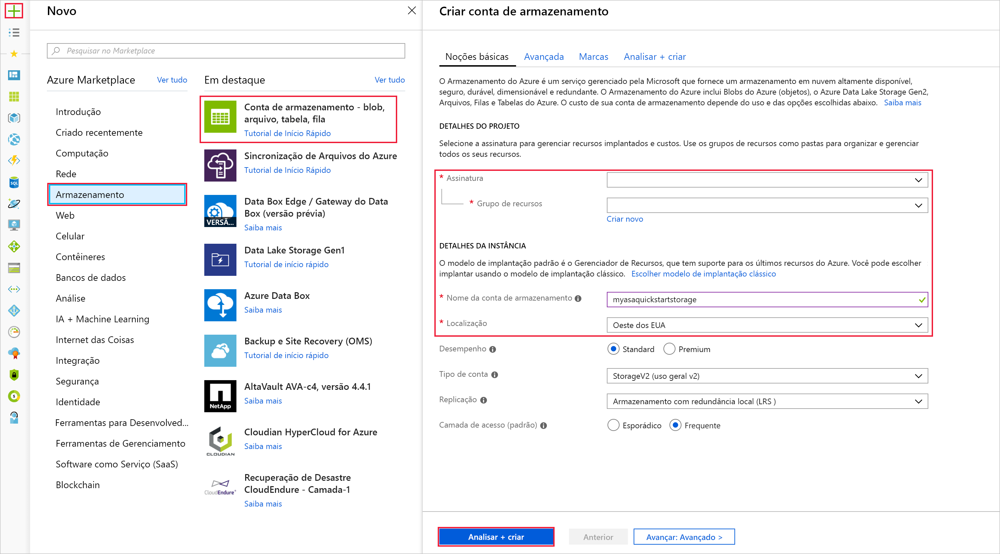

3. Assim que sua conta de armazenamento tiver sido criada, selecione o bloco **Blobs** no painel **Visão geral**.

   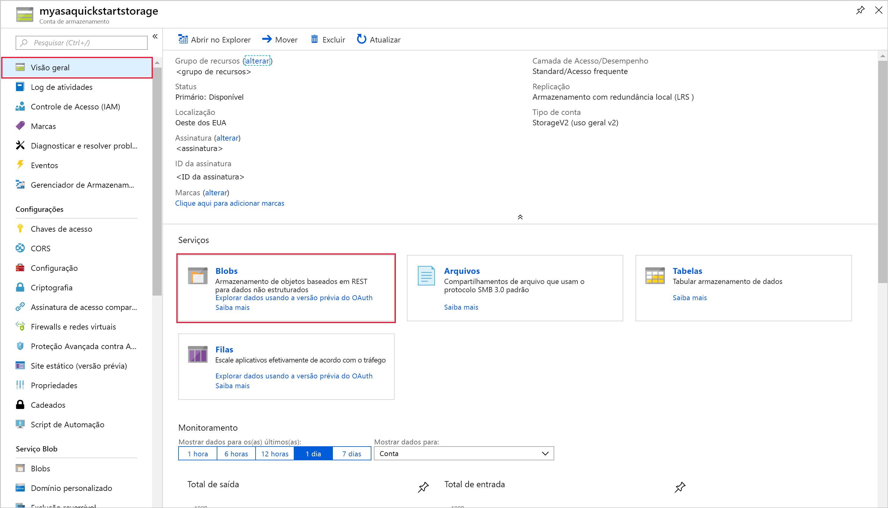

4. Na página **Serviço Blob**, selecione **Contêiner** e forneça um nome a ele, por exemplo, *conteiner1*. Deixe o **Nível de acesso público** como **Particular (sem acesso anônimo)** e selecione **OK**.

   

## <a name="create-a-stream-analytics-project"></a>Criar um projeto do Stream Analytics

1. No Visual Studio Code, pressione **CTRL+Shift+P** para abrir a paleta de comandos. Em seguida, digite **ASA** e selecione **ASA: Criar Novo Projeto**.

   

2. Insira o nome do projeto, como **myASAproj** e selecione uma pasta para o projeto.

    

3. O novo projeto será adicionado ao seu espaço de trabalho. Um projeto ASA consiste no script de consulta **(*.asaql)**, um arquivo **JobConfig.json** e um arquivo de configuração **asaproj.json**.

   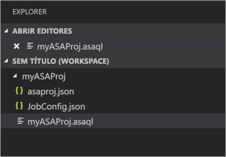

4. O arquivo de configuração **asaproj.json** contém as entradas, saídas e informações do arquivo de configuração do trabalho necessárias para enviar o trabalho do Stream Analytics ao Azure.

   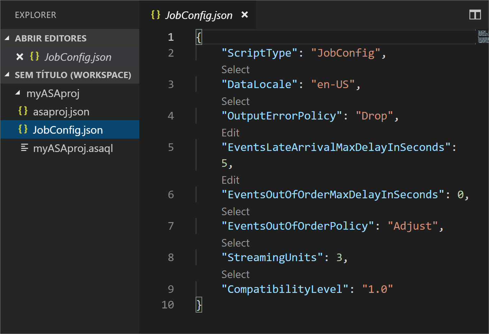

> [!Note]
> Ao adicionar entradas e saídas da paleta de comandos, os caminhos correspondentes serão adicionados ao **asaproj.json** automaticamente. Se você adicionar ou remover entradas ou saídas no disco de maneira direta, será necessário adicioná-las ou removê-las manualmente no **asaproj.json**. É possível optar por colocar as entradas e saídas em um local e, em seguida, referenciá-las em diferentes trabalhos, especificando os caminhos em cada **asaproj.json**.

## <a name="define-an-input"></a>Definir uma entrada

1. Selecione **Ctrl+Shift+P** para abrir a paleta de comandos e digite **ASA: Adicionar Entrada**.

   

2. Escolha **Hub IoT** para o tipo de entrada.

   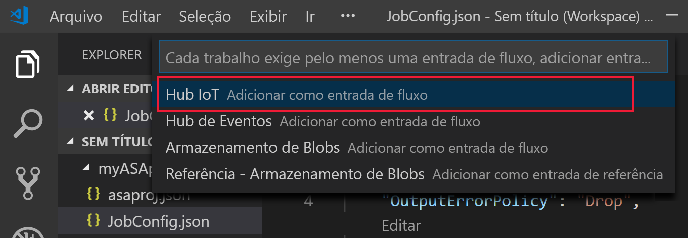

3. Escolha o script de consulta do ASA que usará a entrada. Ele deve popular automaticamente com o caminho de arquivo para **myASAproj.asaql**.

   

4. Insira o nome do arquivo de entrada como **IotHub.json**.

5. Edite **IoTHub.json** com os seguintes valores. Mantenha os valores padrão para os campos não mencionados abaixo. É possível usar o CodeLens para ajudá-lo a inserir uma cadeia de caracteres, selecionar em uma lista suspensa ou alterar o texto diretamente no arquivo.

   |Configuração|Valor sugerido|DESCRIÇÃO|
   |-------|---------------|-----------|
   |NOME|Entrada|Insira um nome para identificar a entrada do trabalho.|
   |IotHubNamespace|MyASAIoTHub|Escolha ou insira o nome do Hub IoT. Os nomes do Hub IoT são detectados automaticamente se eles são criados na mesma assinatura.|
   |EndPoint|Mensagens| |
   |SharedAccessPolicyName|iothubowner| |

## <a name="define-an-output"></a>Definir uma saída

1. Selecione **Ctrl+Shift+P** para abrir a paleta de comandos. Em seguida, insira **ASA: Adicionar Saída**.

   

2. Escolha **Armazenamento de Blobs** para o tipo de Coletor.

3. Escolha o script de consulta do ASA que usará essa entrada.

4. Insira o nome do arquivo de saída como **BlobStorage.json**.

5. Edite **BlobStorage.json** com os seguintes valores. Mantenha os valores padrão para os campos não mencionados abaixo. Use o CodeLens para ajudá-lo a inserir uma cadeia de caracteres ou selecionar em uma lista suspensa.

   |Configuração|Valor sugerido|DESCRIÇÃO|
   |-------|---------------|-----------|
   |NOME|Saída| Insira um nome para identificar a saída do trabalho.|
   |Conta de armazenamento|asaquickstartstorage|Escolha ou insira o nome da conta de armazenamento. Os nomes das contas de armazenamento são detectados automaticamente quando elas são criadas na mesma assinatura.|
   |Contêiner|container1|Selecione o contêiner existente que você criou em sua conta de armazenamento.|
   |Padrão de caminho|output|Digite o nome do caminho de arquivo a ser criado dentro do contêiner.|

## <a name="define-the-transformation-query"></a>Definir a consulta de transformação

1. Abra **myASAproj.asaql** da pasta de projeto.

2. Adicione a consulta a seguir:

   ```sql
   SELECT * 
   INTO Output
   FROM Input
   HAVING Temperature > 27
   ```

## <a name="compile-the-script"></a>Compilar o script

A compilação de scripts faz duas coisas: verificar a sintaxe e gerar os modelos do Azure Resource Manager para implantação automática.

Há duas maneiras para disparar a compilação de scripts:

1. Selecione o script do espaço de trabalho e, em seguida, dispare a compilação na paleta de comandos. 

   

2. Clique com botão direito no script e selecione **ASA: compilar script**.

    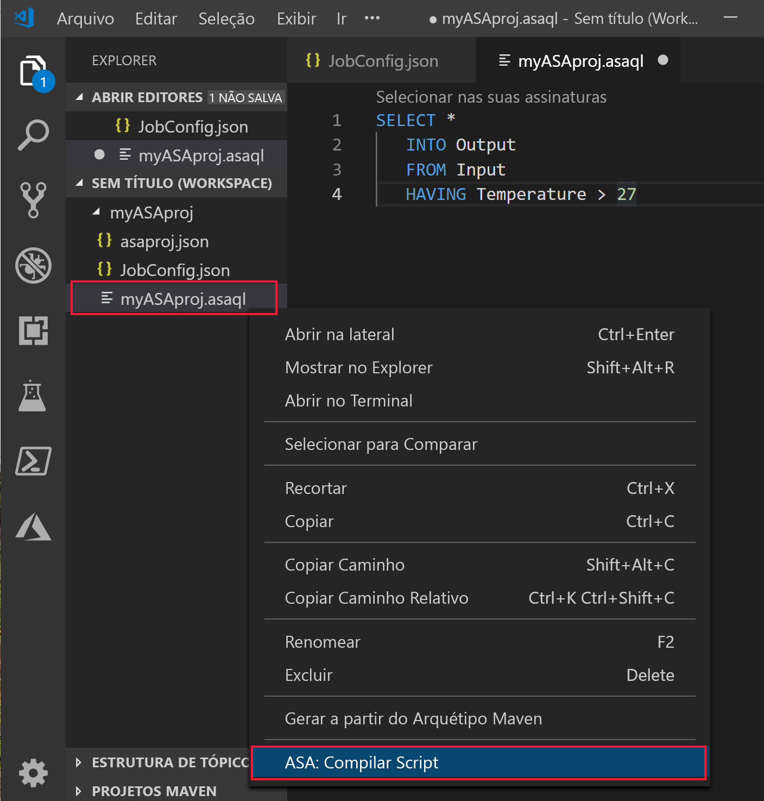

3. Após a compilação, é possível encontrar os dois modelos do Azure Resource Manager gerados na pasta **Implantar** do projeto. Esses dois arquivos são usados para implantação automática.

    

## <a name="submit-a-stream-analytics-job-to-azure"></a>Enviar um trabalho do Stream Analytics ao Azure

1. Na janela do editor de scripts do Visual Studio Code, selecione **Selecionar a partir das assinaturas**.

   

2. Selecione a assinatura na lista pop-up.

3. Selecione um trabalho**. Em seguida, escolha Criar um novo trabalho.

4. Insira o nome do trabalho **myASAjob** e, em seguida, siga as instruções para escolher o grupo de recursos e o local.

5. Selecione **Enviar para o Azure**. Os logs podem ser encontrados na janela de saída. 

6. Quando o trabalho é criado, você poderá vê-lo no Stream Analytics Explorer.

## <a name="run-the-iot-simulator"></a>Executar o simulador de IoT

1. Abra o [Simulador Online de IoT do Azure do Raspberry Pi](https://azure-samples.github.io/raspberry-pi-web-simulator/) em uma nova janela ou guia do navegador.

2. Substitua o espaço reservado na Linha 15 pela cadeia de conexão do dispositivo do Hub IoT do Azure salva em uma seção anterior.

3. Clique em **Executar**. A saída deve exibir os dados de sensor e as mensagens que estão sendo enviadas ao Hub IoT.

   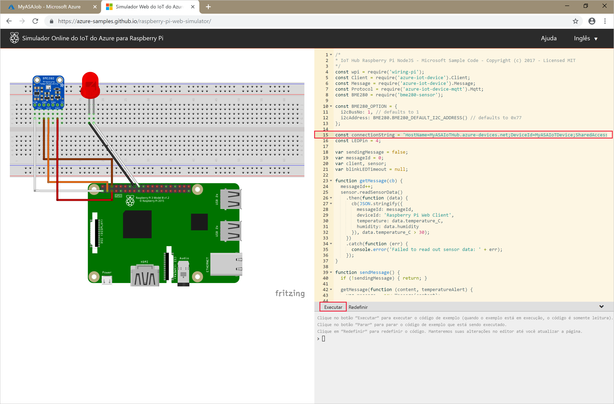

## <a name="start-the-stream-analytics-job-and-check-output"></a>Inicie o trabalho do Stream Analytics e verifique a saída

1. Abra o **Stream Analytics Explorer** no Visual Studio Code e localize o trabalho **myASAJob**.

2. Clique com botão direito no nome do trabalho. Em seguida, selecione **Iniciar** no menu de contexto.

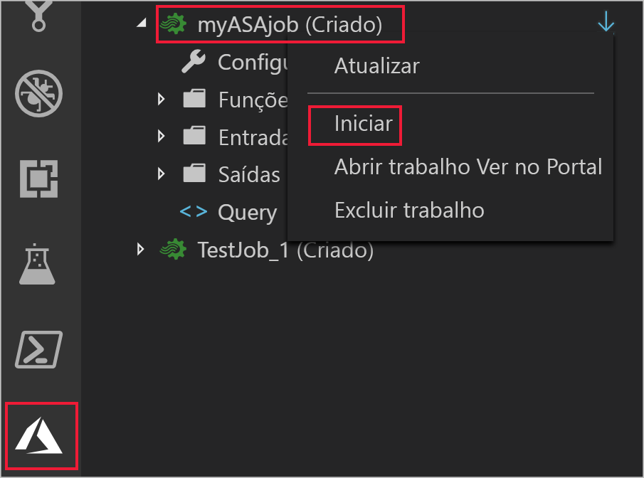

3. Escolha **Agora** na janela pop-up para iniciar o trabalho.

4. Observe que o status do trabalho foi alterado para **Executando**. Clique com botão direito no nome do trabalho e escolha **Abrir Exibição de Trabalho no Portal** para ver as métricas de evento de entrada e saída. Essa ação pode levar alguns minutos.

5. Para exibir os resultados, abra o armazenamento de blobs na extensão do Visual Studio Code ou no portal do Azure.

## <a name="clean-up-resources"></a>Limpar recursos

Quando não forem mais necessários, exclua o grupo de recursos, o trabalho de streaming e todos os recursos relacionados. A exclusão do trabalho evita a cobrança das unidades de streaming consumidas por ele. Se você está planejando usar o trabalho no futuro, pode interrompê-lo e reiniciar mais tarde, quando necessário. Se você não for mais usar o trabalho, exclua todos os recursos criados neste início rápido usando as seguintes etapas:

1. No menu à esquerda no Portal do Azure, selecione **Grupos de recursos** e selecione o nome do recurso criado.  

2. Em sua página de grupo de recursos, selecione **Excluir**, digite o nome do recurso para excluir na caixa de texto e selecione **Excluir**.

## <a name="next-steps"></a>Próximas etapas

Neste guia de início rápido, você implantou um trabalho simples do Stream Analytics usando o Visual Studio Code. Também é possível implantar trabalhos do Stream Analytics usando o [portal do Azure](stream-analytics-quick-create-portal.md), o [PowerShell](stream-analytics-quick-create-powershell.md) e o Visual Studio (stream-analytics-quick-create-vs.md). 

Para saber mais sobre as ferramentas do Azure Stream Analytics para Visual Studio, vá para o seguinte artigo:

> [!div class="nextstepaction"]
> [Use o Microsoft Visual Studio para visualizar os trabalhos do Azure Stream Analytics](stream-analytics-vs-tools.md)