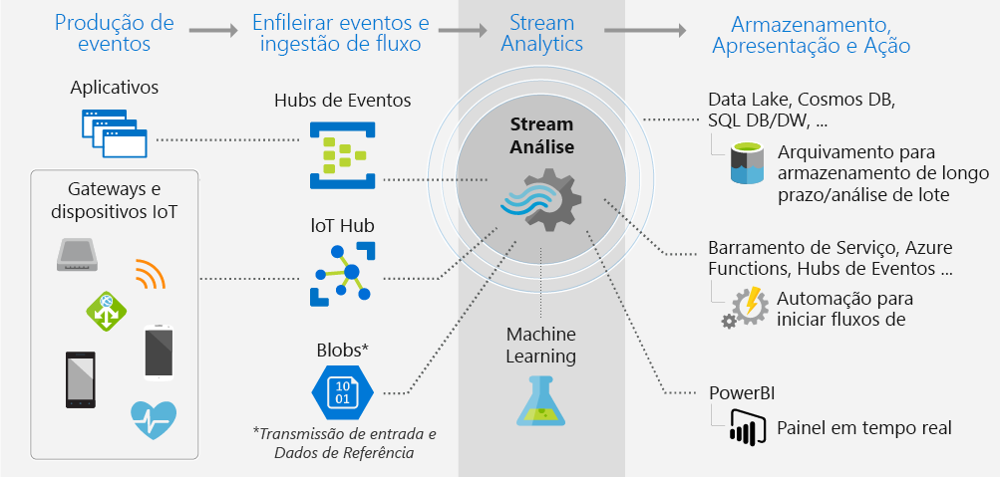
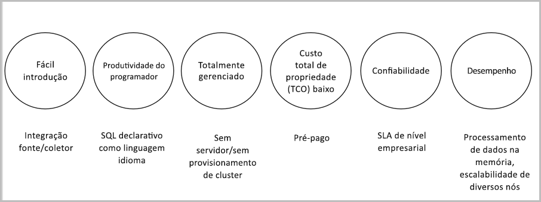

# O que é o Azure Stream Analytics?

O Azure Stream Analytics é um mecanismo de processamento de eventos que permite examinar grandes volumes de fluxo de dados de dispositivos. Os dados de entrada podem ser de dispositivos, de sensores, de sites da Web, de feeds de mídias sociais, de aplicativos e muito mais. Ele também dá suporte à extração de informações dos fluxos de dados, identificando padrões e relações. Assim, você pode usar esses padrões para disparar outras ações downstream, como criar alertas, inserir informações em uma ferramenta de relatórios ou armazená-los para uso posterior.

Abaixo vemos alguns exemplos em que o Azure Stream Analytics pode ser usado: 

* Fusão do sensor de IoT (Internet das Coisas) e análise em tempo real na telemetria do dispositivo
* Análise de sequência de cliques/blogs
* Análise geoespacial para gerenciamento de frotas e veículos sem motoristas
* Monitoramento remoto e manutenção preditiva de ativos de alto valor
* Análise em tempo real em dados de pontos de venda para detecção de anomalias e controle de estoque

## Como funciona o Stream Analytics?

O Azure Stream Analytics inicia com uma fonte de fluxo de dados que são ingeridos pelo Hub de Eventos do Azure, pelo Hub IoT do Azure ou por um armazenamento de dados, como o Armazenamento de Blobs do Azure. Para examinar os fluxos, você deve criar um trabalho do Stream Analytics que especifica a fonte de entrada que está transmitindo os dados. O trabalho também especifica uma consulta de transformação que define como procurar dados, padrões ou relações. A consulta de transformação usa uma linguagem de consulta SQL para filtrar, classificar, agregar e associar dados de streaming facilmente em um período de tempo. Ao executar o trabalho, você pode ajustar as opções de ordenação de eventos e a duração das janelas de tempo na execução de operações de agregação.

Depois de analisar os dados de entrada, você especifica uma saída para os dados transformados e pode controlar o que deve ser feito em resposta às informações analisadas. Por exemplo, você pode executar ações como:

* Enviar dados para uma fila monitorada para disparar alertas ou fluxos de trabalho personalizados downstream.
* Envie dados ao painel do Power BI para visualização em tempo real.
* Armazenar dados para outros serviços de armazenamento do Azure, para que você possa treinar um modelo de machine learning com base em dados históricos ou executar análise em lote.

A imagem a seguir ilustra o pipeline do Stream Analytics. O trabalho do Stream Analytics pode usar todas as entradas e saídas de um conjunto selecionado. Esta imagem mostra como os dados são enviados ao Stream Analytics, analisados e enviados para outras ações, como armazenamento ou apresentação:

## Principais recursos e benefícios

O Azure Stream Analytics foi projetado para ser fácil de usar, flexível, confiável e escalonável para qualquer tamanho de trabalho. Ele está disponível em várias regiões do Azure. A imagem abaixo ilustra os principais recursos do Azure Stream Analytics:

## Facilidade de uso do guia de introdução

É fácil começar a usar o Azure Stream Analytics. Bastam alguns cliques para se conectar a várias fontes e coletores e para criar um pipeline de ponta a ponta. O Stream Analytics pode se conectar aos [Hubs de Eventos do Azure](https://docs.microsoft.com/azure/event-hubs/) e ao [Hub IoT do Azure](https://docs.microsoft.com/azure/iot-hub/) para a ingestão de dados de streaming. Ele também pode se conectar ao serviço [Armazenamento de Blobs do Azure](https://docs.microsoft.com/azure/storage/storage-introduction) para a ingestão de dados históricos. Ele pode combinar dados de hubs de eventos com outras fontes de dados e mecanismos de processamento. A entrada de trabalho também pode incluir dados de referência que sejam estáticos ou dados com alteração lenta, e você pode unir dados de streaming a esses dados de referência para executar operações de pesquisa.

O Stream Analytics pode rotear saída de trabalho para vários sistemas de armazenamento, como os [Blobs do Azure](https://docs.microsoft.com/azure/storage/storage-introduction), o [Banco de Dados SQL do Azure](https://docs.microsoft.com/azure/sql-database/), o [Azure Data Lake Store](https://docs.microsoft.com/azure/data-lake-store/) ou o [Azure Cosmos DB ](https://docs.microsoft.com/azure/cosmos-db/introduction). Depois de armazenar, você pode executar a análise em lotes com o Azure HDInsight ou enviar a saída para outro serviço como os Hubs de Eventos, para ser consumido ou para o [Power BI](https://docs.microsoft.com/power-bi/) para visualização em tempo real usando a API de streaming do Power BI.

## Produtividade do programador

O Azure Stream Analytics usa uma linguagem de consulta baseada em SQL simples que foi aumentada com restrições temporais avançadas para analisar os dados em movimento. Para definir as transformações de trabalho, use uma [Linguagem de consulta do Stream Analytics](https://msdn.microsoft.com/library/azure/dn834998.aspx) simples e declarativa que permite criar consultas temporais e análises complexas usando constructos SQL simples. A linguagem de consulta do Stream Analytics é consistente com a linguagem SQL; basta estar familiarizado com a linguagem SQL para começar a criar trabalhos. Você também pode criar trabalhos usando ferramentas de desenvolvedor, como o Azure PowerShell, [ferramentas do Visual Studio para o Stream Analytics](stream-analytics-tools-for-visual-studio-install.md) ou modelos do Azure Resource Manager. O uso de ferramentas de desenvolvedor permite a você criar consultas de transformação offline e usar o [pipeline CI/CD](stream-analytics-tools-for-visual-studio-cicd.md) para enviar trabalhos ao Azure. 

A linguagem de consulta do Stream Analytics oferece uma ampla variedade de funções para analisar e processar os dados de streaming. Essa linguagem de consulta dá suporte a funções de manipulação de dados e de agregação simples para funções geoespaciais complexas. Você pode editar consultas no portal e testá-las usando os dados de exemplo que são extraídos do fluxo ativo.

Você pode estender os recursos da linguagem de consulta definindo e chamando funções adicionais. Você pode definir as chamadas de função no serviço Azure Machine Learning para tirar proveito das soluções desta e integrar UDFs (funções definidas pelo usuário) JavaScript ou agregações definidas pelo usuário para executar cálculos complexos como parte de uma consulta do Stream Analytics.

## Totalmente gerenciado 

O Azure Stream Analytics é uma oferta sem servidor (PaaS) totalmente gerenciada no Azure. Isso significa que você não precisa provisionar hardware ou gerenciar clusters para executar seus trabalhos. O Azure Stream Analytics gerencia seu trabalho integralmente, cuidando da configuração de clusters de computação complexos na nuvem e ajustando o desempenho necessário para executar o trabalho. A Integração com os Hubs de Eventos do Azure e o Hub IoT do Azure permite que a solução ingira milhões de eventos por segundo, provenientes de dispositivos conectados, cliques em fluxos e arquivos de log, para citar alguns. Usando o recurso de partição dos hubs de eventos, você pode dividir os cálculos em etapas lógicas, cada um com a capacidade de ser mais particionado para aumentar a escalabilidade.

## Executar na nuvem na borda inteligente

O Azure Stream Analytics pode ser executado na nuvem, para uma análise em larga escala, ou na borda inteligente para análise de latência extremamente baixa.
O Azure Stream Analytics usa a mesma linguagem de consulta na nuvem e na borda inteligente, permitindo que os desenvolvedores criem arquiteturas realmente híbridas para processamento de fluxo.

## Custo total de propriedade baixo

Como um serviço de nuvem, o Stream Analytics é otimizado para que você possa economizar custos. Não há nenhum custo inicial envolvido; você só paga pelas [unidades de streaming que consumir](stream-analytics-streaming-unit-consumption.md) e pela quantidade de dados processados. Não há nenhum compromisso ou provisionamento de cluster necessário. Você pode expandir ou reduzir seus trabalhos de streaming com base nas necessidades do negócio. 

## Pronto para necessidades críticas
O Azure Stream Analytics está disponível em várias regiões em todo o mundo e foi projetado para executar cargas de trabalho críticas, dando suporte a requisitos de confiabilidade, segurança e conformidade.
### Confiabilidade
O Azure Stream Analytics garante o processamento de eventos exatamente uma vez e pelo menos uma entrega de eventos; portanto, os eventos nunca são perdidos. O processamento exatamente uma vez é garantido com a saída selecionada, conforme descrito em [Garantias de entrega de evento](https://docs.microsoft.com/en-us/stream-analytics-query/event-delivery-guarantees-azure-stream-analytics). O Azure Stream Analytics tem funcionalidades internas de recuperação no caso de falha na entrega de um evento. Além disso, o Stream Analytics fornece um ponto de verificação interno para manter o estado do trabalho e fornece resultados reproduzíveis.

Como um serviço gerenciado, o Stream Analytics garante o processamento de eventos com 99,9% de disponibilidade no nível do minuto. Para obter mais informações, confira a página do [SLA do Stream Analytics](https://azure.microsoft.com/support/legal/sla/stream-analytics/v1_0/) que contém mais detalhes. 

### Segurança
Em termos de segurança, o Azure Stream Analytics criptografa todas as comunicações de entrada e de saída e dá suporte ao TLS 1.2. Os pontos de verificação internos também são criptografados. O Stream Analytics não armazena os dados de entrada, pois todo o processamento é feito na memória. 

### Conformidade
O Azure Stream Analytics segue várias certificações de conformidade, conforme descrito na [Visão geral de conformidade do Azure](https://gallery.technet.microsoft.com/Overview-of-Azure-c1be3942). 

## Desempenho

O Stream Analytics pode processar milhões de eventos por segundo e fornecer resultados com baixa latência.
Ele permite que você escale verticalmente e expanda para lidar com aplicativos grandes de processamento de eventos complexos e em tempo real. O Stream Analytics é compatível com o desempenho por meio do particionamento, permitindo que consultas complexas sejam colocadas em paralelo e executadas em vários nós de streaming.
O Azure Stream Analytics é criado no [Trill](https://github.com/Microsoft/Trill), um mecanismo de análise de streaming na memória de alto desempenho desenvolvido em colaboração com a Microsoft Research. 

## Próximas etapas

Agora você tem uma visão geral do Azure Stream Analytics. Em seguida, você pode se aprofundar e criar seu primeiro trabalho do Stream Analytics:

* [Criar um trabalho do Stream Analytics usando o portal do Azure](stream-analytics-quick-create-portal.md).
* [Criar um trabalho do Stream Analytics usando o Azure PowerShell](stream-analytics-quick-create-powershell.md).
* [Criar um trabalho do Stream Analytics usando o Visual Studio](stream-analytics-quick-create-vs.md).

