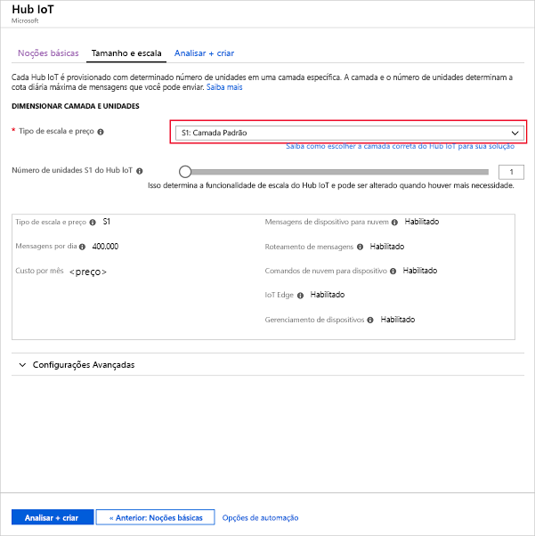
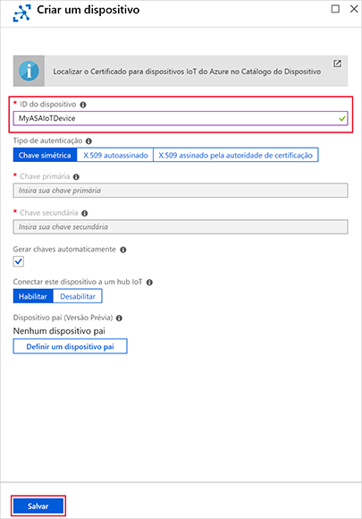
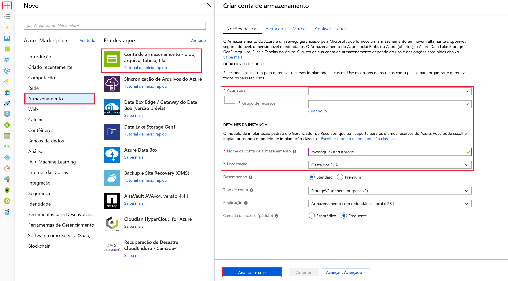
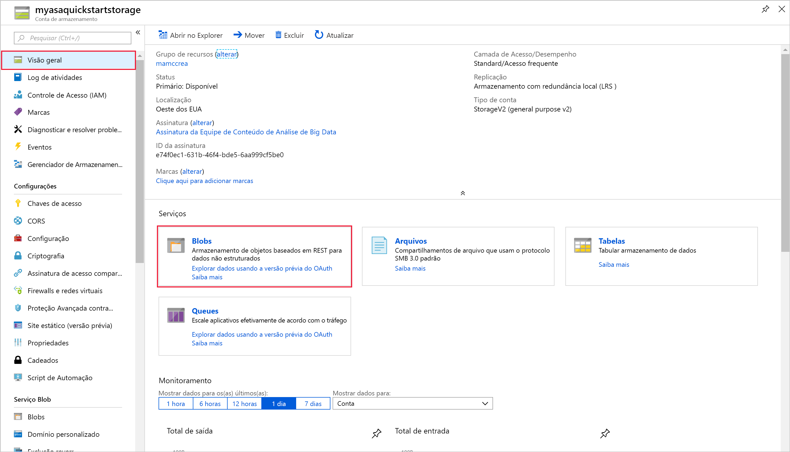
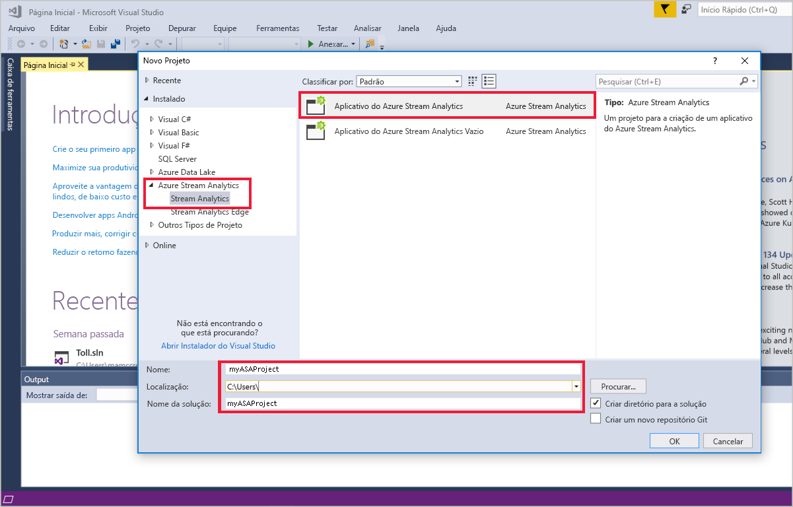
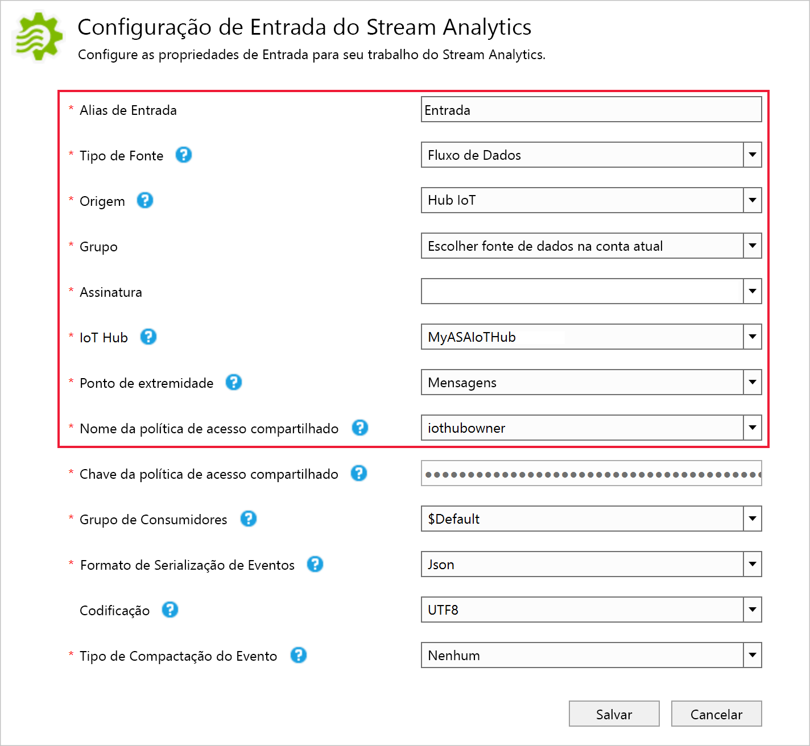
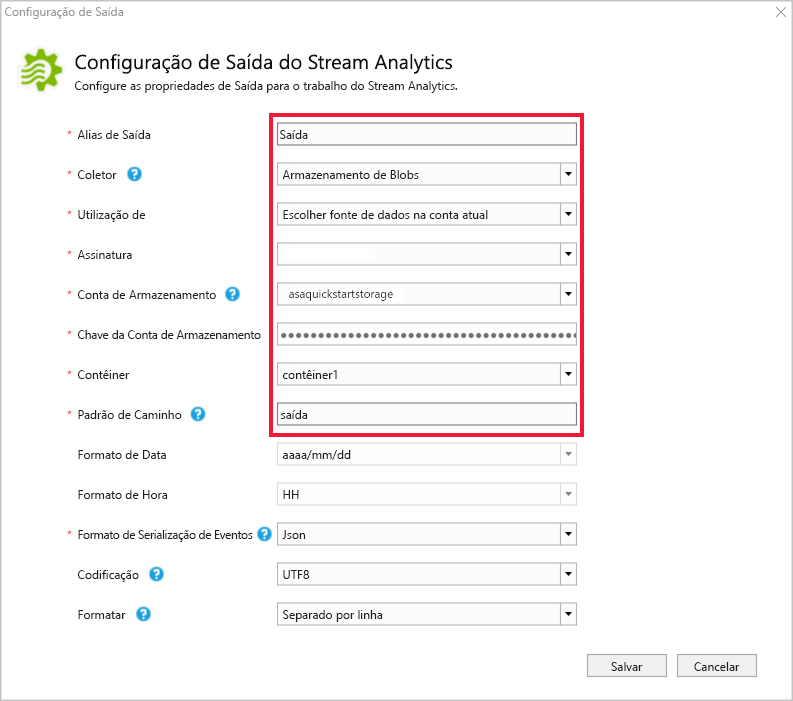
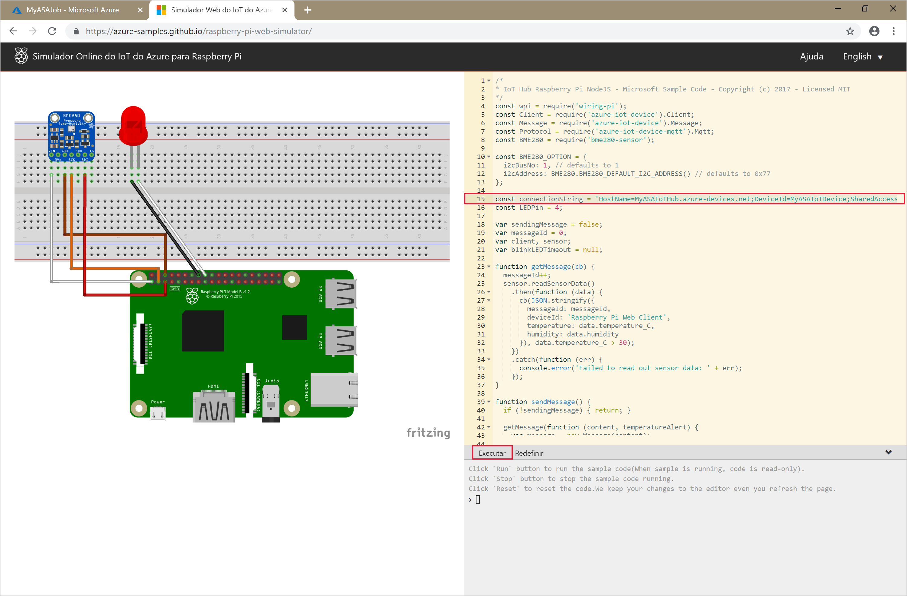
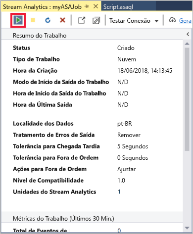

# <a name="quickstart-create-an-azure-stream-analytics-job-by-using-visual-studio"></a>Início Rápido: Criar um trabalho do Azure Stream Analytics usando o Visual Studio

Este guia de início rápido mostra como criar e executar um trabalho do Stream Analytics usando ferramentas do Azure Stream Analytics para Visual Studio. O trabalho de exemplo lê dados de streaming de um dispositivo Hub IoT. Você definirá um trabalho que calcula a temperatura média quando ela ultrapassa 27° e que grava os eventos de saída resultantes em um novo arquivo no armazenamento de blobs.

## <a name="before-you-begin"></a>Antes de começar

* Se você não tiver uma assinatura do Azure, crie uma [conta gratuita](https://azure.microsoft.com/free/).

* Entre no [Portal do Azure](https://portal.azure.com/).

* Instale o Visual Studio 2019, Visual Studio 2015 ou Visual Studio 2013 Update 4. As edições Enterprise (Ultimate/Premium), Professional, Community têm suporte. Não há suporte para a Edição Express.

* Siga as [instruções de instalação](https://docs.microsoft.com/azure/stream-analytics/stream-analytics-tools-for-visual-studio-install) para instalar as ferramentas do Stream Analytics para o Visual Studio.

## <a name="prepare-the-input-data"></a>Preparar os dados de entrada

Antes de definir o trabalho do Stream Analytics, você deve preparar os dados, que serão posteriormente configurados como a entrada do trabalho. Para preparar os dados de entrada exigidos pelo trabalho, complete as seguintes etapas:

1. Entre no [Portal do Azure](https://portal.azure.com/).

2. Selecione **Criar um recurso** > **Internet das Coisas** > **Hub IoT**.

3. No painel do **Hub IoT**, insira as seguintes informações:
   
   |**Configuração**  |**Valor sugerido**  |**Descrição**  |
   |---------|---------|---------|
   |Subscription  | \<Sua assinatura\> |  Selecione a assinatura do Azure que você deseja usar. |
   |Resource group   |   asaquickstart-resourcegroup  |   Selecione **Criar Novo** e insira um novo nome de grupo de recursos para a conta. |
   |Região  |  \<Selecione a região mais próxima de seus usuários\> | Selecione uma localização geográfica na qual você possa hospedar o Hub IoT. Use a localização mais próxima dos usuários. |
   |Nome do Hub IoT  | MyASAIoTHub  |   Selecione um nome para o Hub IoT.   |

   

4. Selecione **Avançar: Definir o tamanho e a escala**.

5. Escolha **Tipo de preço e escala**. Para este início rápido, selecione a camada **F1 – Gratuita**, caso ela ainda esteja disponível em sua assinatura. Se a camada gratuita não estiver disponível, escolha a camada mais baixa disponível. Para obter mais informações, consulte [Preço do Hub IoT](https://azure.microsoft.com/pricing/details/iot-hub/).

   

6. Selecione **Examinar + criar**. Examine as informações do Hub IoT e clique em **Criar**. A criação do Hub IoT pode levar alguns minutos. Você pode monitorar o progresso no painel **Notificações**.

7. No menu de navegação do Hub IoT, clique em **Adicionar** em **Dispositivos IoT**. Adicione uma **ID do dispositivo** e clique em **Salvar**.

   

8. Assim que o dispositivo tiver sido criado, abra-o na lista **Dispositivos IoT**. Copie a **Cadeia de conexão – chave primária** e salve-a em um bloco de notas para uso futuro.

   

## <a name="create-blob-storage"></a>Criar o armazenamento de blobs

1. No canto superior esquerdo do portal do Azure, selecione **Criar um recurso** > **Armazenamento** > **Conta de armazenamento**.

2. No painel **Criar conta de armazenamento**, insira um nome para a conta de armazenamento, um local e um grupo de recursos. Escolha o mesmo local e grupo de recursos do Hub IoT criado. Clique em **Revisar + criar** para criar a conta.

   

3. Assim que sua conta de armazenamento tiver sido criada, selecione o bloco **Blobs** no painel **Visão geral**.

   

4. Na página **Serviço Blob**, selecione **Contêiner** e forneça um nome a ele, por exemplo, *conteiner1*. Deixe o **Nível de acesso público** como **Particular (sem acesso anônimo)** e selecione **OK**.

   

## <a name="create-a-stream-analytics-project"></a>Criar um projeto do Stream Analytics

1. Inicie o Visual Studio.

2. Selecione **Arquivo > Novo Projeto**.  

3. Na lista de modelos à esquerda, selecione **Stream Analytics** e então selecione **Aplicativo do Stream Analytics do Azure**.  

4. Digite o **Nome** e **Local** do projeto e o **Nome da solução** e selecione **OK**.

   

Observe os elementos que são incluídos em um projeto do Azure Stream Analytics.

   


## <a name="choose-the-required-subscription"></a>Escolha a assinatura necessária

1. No Visual Studio, no menu **Exibir**, selecione **Gerenciador de Servidores**.

2. Clique com o botão direito do mouse em **Azure**, selecione **Conectar-se à assinatura do Microsoft Azure** e, em seguida, entre com a conta do Azure.

## <a name="define-input"></a>Definir entrada

1. No **Gerenciador de Soluções**, expanda o nó **Entradas** e clique duas vezes em **Input.json**.

2. Preencha a **Configuração de entrada do Stream Analytics** com os seguintes valores:

   |**Configuração**  |**Valor sugerido**  |**Descrição**   |
   |---------|---------|---------|
   |Alias de entrada  |  Entrada   |  Insira um nome para identificar a entrada do trabalho.   |
   |Tipo de Fonte   |  Fluxo de dados |  Escolha a fonte de entrada apropriada: Fluxo de Dados ou Dados de Referência.   |
   |Fonte  |  Hub IoT |  Escolha a fonte de entrada apropriada.   |
   |Recurso  | Escolha fonte de dados da conta atual | Escolha entre inserir os dados manualmente ou selecione uma conta existente.   |
   |Subscription  |  \<Sua assinatura\>   | Selecione a assinatura do Azure que tem o Hub IoT criado.   |
   |Hub IoT  |  MyASAIoTHub   |  Escolha ou insira o nome do Hub IoT. Os nomes do Hub IoT são detectados automaticamente se eles são criados na mesma assinatura.   |
   
3. Deixe as outras opções com os valores padrão e selecione **Salvar** para salvar as configurações.  

   

## <a name="define-output"></a>Definir saída

1. No **Gerenciador de Soluções**, expanda o nó **Saídas** e clique duas vezes em **Output.json**.

2. Preencha a **Configuração de saída do Stream Analytics** com os seguintes valores:

   |**Configuração**  |**Valor sugerido**  |**Descrição**   |
   |---------|---------|---------|
   |Alias de saída  |  Saída   |  Insira um nome para identificar a saída do trabalho.   |
   |Coletor   |  Armazenamento de Blobs |  Escolha o coletor apropriado.    |
   |Recurso  |  Forneça as configurações da fonte de dados manualmente |  Escolha entre inserir os dados manualmente ou selecione uma conta existente.   |
   |Subscription  |  \<Sua assinatura\>   | Selecione a assinatura do Azure que tem a conta de armazenamento criada. A conta de armazenamento pode estar na mesma assinatura ou em uma diferente. Este exemplo pressupõe que você criou a conta de armazenamento na mesma assinatura.   |
   |Conta de armazenamento  |  asaquickstartstorage   |  Escolha ou insira o nome da conta de armazenamento. Os nomes das contas de armazenamento são detectados automaticamente quando elas são criadas na mesma assinatura.   |
   |Contêiner  |  container1   |  Selecione o contêiner existente que você criou em sua conta de armazenamento.   |
   |Padrão de caminho  |  output   |  Digite o nome do caminho de arquivo a ser criado dentro do contêiner.   |
   
3. Deixe as outras opções com os valores padrão e selecione **Salvar** para salvar as configurações.  

   

## <a name="define-the-transformation-query"></a>Definir a consulta de transformação

1. Abra **Script.asaql** no **Gerenciador de Soluções** no Visual Studio.

2. Adicione a consulta a seguir:

   ```sql
   SELECT *
   INTO BlobOutput
   FROM IoTHubInput
   HAVING Temperature > 27
   ```

## <a name="submit-a-stream-analytics-query-to-azure"></a>Enviar uma consulta do Stream Analytics para o Azure

1. No **Editor de Consultas**, selecione **Enviar para o Azure** no editor de scripts.

2. Selecione **Criar um novo trabalho do Azure Stream Analytics** e insira um **Nome de trabalho**. Escolha a **Assinatura**, **Grupo de recursos**, e o **Local** usados no começo do Início Rápido.

   

## <a name="run-the-iot-simulator"></a>Executar o simulador de IoT

1. Abra o [Simulador Online de IoT do Azure do Raspberry Pi](https://azure-samples.github.io/raspberry-pi-web-simulator/) em uma nova janela ou guia do navegador.

2. Substitua o espaço reservado na Linha 15 pela cadeia de conexão do dispositivo do Hub IoT do Azure salva em uma seção anterior.

3. Clique em **Executar**. A saída deve exibir os dados de sensor e as mensagens que estão sendo enviadas ao Hub IoT.

   

## <a name="start-the-stream-analytics-job-and-check-output"></a>Inicie o trabalho do Stream Analytics e verifique a saída

1. Após o trabalho ser criado, a exibição do trabalho abrirá automaticamente. Selecione o botão de seta verde para iniciar o trabalho,

   

2. Altere o **Modo de início de saída do trabalho** para **JobStartTime** e selecione **Iniciar**.

   

3. Observe que o status do trabalho foi alterado para **Em execução** e há eventos de entrada/saída. Isso pode levar alguns minutos.

   

4. Para exibir os resultados, no menu **Exibição**, selecione **Cloud Explorer** e navegue até a conta de armazenamento em seu grupo de recursos. Em **Contêineres de Blobs**, clique duas vezes em **container1**e, em seguida, n caminho do arquivo de **saída**.

   

## <a name="clean-up-resources"></a>Limpar recursos

Quando não forem mais necessários, exclua o grupo de recursos, o trabalho de streaming e todos os recursos relacionados. A exclusão do trabalho evita a cobrança das unidades de streaming consumidas por ele. Se você está planejando usar o trabalho no futuro, pode interrompê-lo e reiniciar mais tarde, quando necessário. Se você não for mais usar o trabalho, exclua todos os recursos criados neste início rápido usando as seguintes etapas:

1. No menu à esquerda no Portal do Azure, selecione **Grupos de recursos** e selecione o nome do recurso criado.  

2. Em sua página de grupo de recursos, selecione **Excluir**, digite o nome do recurso para excluir na caixa de texto e selecione **Excluir**.

## <a name="next-steps"></a>Próximas etapas

Neste guia de início rápido, você implantou um trabalho simples do Stream Analytics usando o Visual Studio. Você também pode implantar trabalhos do Stream Analytics usando o [portal do Azure](stream-analytics-quick-create-portal.md) e o [PowerShell](stream-analytics-quick-create-powershell.md). 

Para saber mais sobre as ferramentas do Azure Stream Analytics para Visual Studio, vá para o seguinte artigo:

> [!div class="nextstepaction"]
> [Use o Microsoft Visual Studio para visualizar os trabalhos do Azure Stream Analytics](stream-analytics-vs-tools.md)
