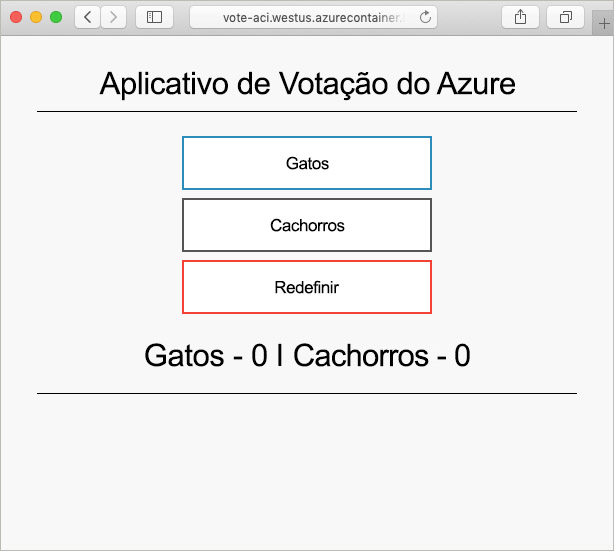

# <a name="quickstart-create-a-terraform-configuration-for-azure"></a>Início Rápido: Criar uma configuração do Terraform no Azure

Neste início rápido, crie recursos do Azure usando o Terraform. As etapas neste artigo orientam você na criação dos seguintes recursos:

> [!div class="checklist"]
> * Instância do Azure Cosmos DB
> * Azure Container Instance
> * Aplicativo que funciona entre esses dois recursos

## <a name="create-first-configuration"></a>Criar a primeira configuração

Nesta seção, crie a configuração para uma instância do Azure Cosmos DB.

1. Entre no [Portal do Azure](https://go.microsoft.com/fwlink/p/?LinkID=525040).

1. Abra o Azure Cloud Shell.

1. Inicie o editor do Cloud Shell:

    ```bash
    code main.tf
    ```

1. A configuração nesta etapa modela alguns recursos do Azure. Esses recursos incluem um grupo de recursos do Azure e uma instância do Azure Cosmos DB. Um inteiro aleatório é usado para criar um nome de instância exclusivo do Cosmos DB. Várias configurações do Cosmos DB também são definidas. Para obter mais informações, confira a [Referência do Terraform do Cosmos DB](https://www.terraform.io/docs/providers/azurerm/r/cosmosdb_account.html). Copie e cole a configuração do Terraform a seguir no editor:

    ```hcl
    resource "azurerm_resource_group" "vote-resource-group" {
      name     = "vote-resource-group"
      location = "westus"
    }

    resource "random_integer" "ri" {
      min = 10000
      max = 99999
    }

    resource "azurerm_cosmosdb_account" "vote-cosmos-db" {
      name                = "tfex-cosmos-db-${random_integer.ri.result}"
      location            = azurerm_resource_group.vote-resource-group.location
      resource_group_name = azurerm_resource_group.vote-resource-group.name
      offer_type          = "Standard"
      kind                = "GlobalDocumentDB"

      consistency_policy {
        consistency_level       = "BoundedStaleness"
        max_interval_in_seconds = 10
        max_staleness_prefix    = 200
      }

      geo_location {
        location          = "westus"
        failover_priority = 0
      }
    }
    ```

1. Salve o arquivo ( **&lt;Ctrl>S**) e saia do editor ( **&lt;Ctrl>Q**).

## <a name="run-the-configuration"></a>Executar a configuração

Nesta seção, use vários comandos do Terraform para executar a configuração.

1. O comando [terraform init](https://www.terraform.io/docs/commands/init.html) inicializa o diretório de trabalho. Execute o seguinte comando no Cloud Shell:

    ```bash
    terraform init
    ```

1. O comando [terraform plan](https://www.terraform.io/docs/commands/plan.html) pode ser usado para validar a sintaxe de configuração. O parâmetro `-out` direciona os resultados para um arquivo. O arquivo de saída pode ser usado posteriormente para aplicar a configuração. Execute o seguinte comando no Cloud Shell:

    ```bash
    terraform plan --out plan.out
    ```

1. O comando [terraform apply](https://www.terraform.io/docs/commands/apply.html) é usado para aplicar a configuração. O arquivo de saída da etapa anterior foi especificado. Esse comando faz com que os recursos do Azure sejam criados. Execute o seguinte comando no Cloud Shell:

    ```bash
    terraform apply plan.out
    ```

1. Para verificar os resultados dentro do portal do Azure, navegue até o novo grupo de recursos. A nova instância do Azure Cosmos DB está no novo grupo de recursos.

## <a name="update-configuration"></a>Atualizar configuração

Esta seção mostra como atualizar a configuração para incluir uma Instância de Contêiner do Azure. O contêiner executa um aplicativo que lê e grava os dados no Cosmos DB.

1. Inicie o editor do Cloud Shell:

    ```bash
    code main.tf
    ```

1. A configuração nesta etapa define duas variáveis de ambiente: `COSMOS_DB_ENDPOINT` e `COSMOS_DB_MASTERKEY`. Essas variáveis armazenam a localização e a chave para acessar o banco de dados. Os valores dessas variáveis são obtidos na instância do banco de dados criada na etapa anterior. Esse processo é conhecido como interpolação. Para saber mais sobre a interpolação do Terraform, confira [Sintaxe de interpolação](https://www.terraform.io/docs/configuration/interpolation.html). A configuração também inclui um bloco de saída, que retorna o FQDN (nome de domínio totalmente qualificado) da instância de contêiner. Copie e cole o seguinte código no editor:

    ```hcl
    resource "azurerm_container_group" "vote-aci" {
      name                = "vote-aci"
      location            = azurerm_resource_group.vote-resource-group.location
      resource_group_name = azurerm_resource_group.vote-resource-group.name
      ip_address_type     = "public"
      dns_name_label      = "vote-aci"
      os_type             = "linux"

      container {
        name   = "vote-aci"
        image  = "microsoft/azure-vote-front:cosmosdb"
        cpu    = "0.5"
        memory = "1.5"
        ports {
          port     = 80
          protocol = "TCP"
        }

        secure_environment_variables = {
          "COSMOS_DB_ENDPOINT"  = azurerm_cosmosdb_account.vote-cosmos-db.endpoint
          "COSMOS_DB_MASTERKEY" = azurerm_cosmosdb_account.vote-cosmos-db.primary_master_key
          "TITLE"               = "Azure Voting App"
          "VOTE1VALUE"          = "Cats"
          "VOTE2VALUE"          = "Dogs"
        }
      }
    }

    output "dns" {
      value = azurerm_container_group.vote-aci.fqdn
    }
    ```

1. Salve o arquivo ( **&lt;Ctrl>S**) e saia do editor ( **&lt;Ctrl>Q**).

1. Como você fez na seção anterior, execute o seguinte comando para exibir as alterações a serem feitas:

    ```bash
    terraform plan --out plan.out
    ```

1. Execute o comando `terraform apply` para aplicar a configuração.

    ```bash
    terraform apply plan.out
    ```

1. Anote o FQDN da instância de contêiner.

## <a name="test-application"></a>Testar aplicativo

Para testar o aplicativo, navegue até o FQDN da instância de contêiner. Você verá resultados semelhantes à seguinte saída:



## <a name="clean-up-resources"></a>Limpar recursos

Quando não forem mais necessários, exclua os recursos criados neste artigo.

Execute o comando [terraform destroy](https://www.terraform.io/docs/commands/destroy.html) para remover os recursos do Azure criados neste tutorial:

```bash
terraform destroy -auto-approve
```

## <a name="next-steps"></a>Próximas etapas

> [!div class="nextstepaction"]
> [Instalar e configurar o Terraform para provisionar recursos do Azure](../virtual-machines/linux/terraform-install-configure.md).