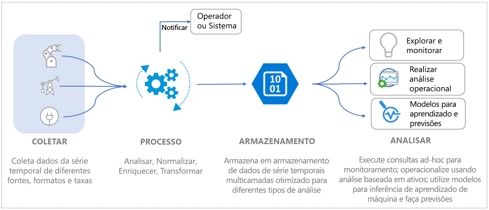
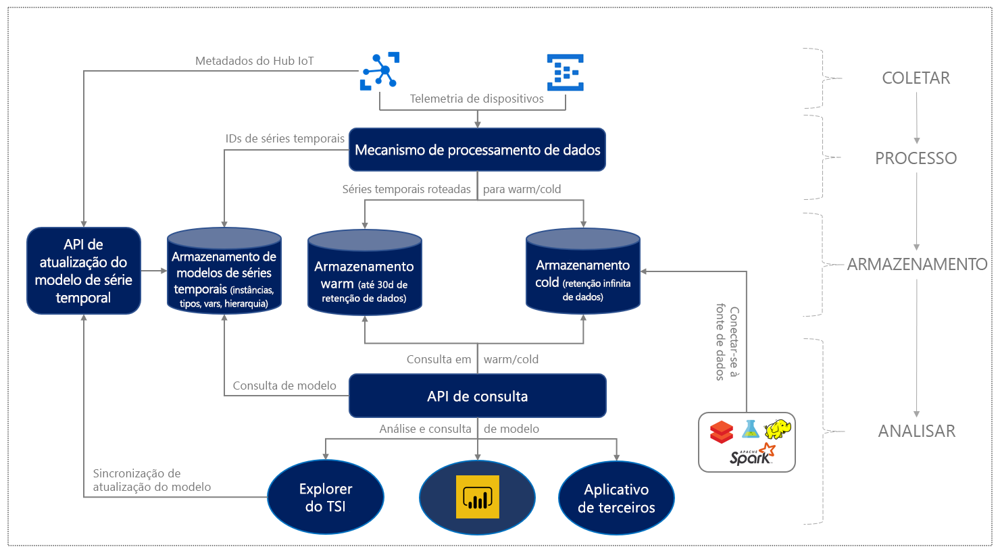

# O que é o Azure Time Series Insights Preview?

O Azure Time Series Insights Preview é uma oferta de plataforma como serviço (PaaS) de ponta a ponta. É usado para coletar, processar, armazenar, analisar e consultar dados de escala de IoT otimizados para série temporal e altamente contextualizados. O Time Series Insights é ideal para exploração de dados ad hoc e para análise operacional. O Time Series Insights é uma oferta de serviço exclusivamente extensível e personalizado que atende às amplas necessidades de implantações de IoT industriais.

> [!TIP]
> Para recursos em disponibilidade geral (GA), leia a [visão geral do Azure Time Series Insights](time-series-insights-overview.md).

## Vídeo

### Saiba mais sobre a versão prévia do Azure Time Series Insights.  

> [!VIDEO https://channel9.msdn.com/Shows/Internet-of-Things-Show/Azure-Time-Series-Insights-e2e-solution-for-industrial-IoT-analytics/player]

## Definir dados de IoT

Dados de IoT são dados industriais disponíveis em organizações com uso intensivo de ativos. Dados de IoT geralmente são altamente não estruturados, porque são enviados de ativos que registram medidas com muitos ruídos. Essas medidas incluem temperatura, movimento e umidade. Esses fluxos de dados são caracterizados frequentemente por grandes lacunas, mensagens corrompidas e leituras falsas. Os dados desses fluxos precisam ser limpos antes da análise.

Dados de IoT geralmente são significativos apenas no contexto de entradas de dados adicionais que vêm de fontes primárias, como CRM ou ERP. As entradas também são provenientes de fontes de dados de terceiros, como clima ou localização.

Por conta disso, apenas uma fração dos dados é usada para fins operacionais e empresariais. Esses dados fornecem informações consistentes, abrangentes, atuais e corretas para análises e relatórios de negócios. Transformar dados de IoT coletados em insights acionáveis requer:

* Processamento de dados para limpar, filtrar, interpolar, transformar e preparar dados para análise.
* Uma estrutura para navegar e compreender os dados, ou seja, para normalizar e contextualizar os dados.
* Armazenamento econômico para retenção de longo prazo ou indefinida de décadas de dados processados ou derivados e de dados brutos.

Um fluxo de dados de IoT típico é mostrado na imagem a seguir.

  

## Azure Time Series Insights para IoT industrial

O panorama atual de IoT é variado. Os clientes abrangem os setores de fabricação, automotivo, energia, utilitários, edifícios inteligentes e consultoria. Os cenários incluem uma exploração de dados ad hoc em que a forma dos dados é desconhecida. Os cenários também incluem a análise operacional em dados esquematizados ou explicitamente modelados para aumentar a eficiência operacional. Esses cenários normalmente existem lado a lado e dão suporte a diferentes casos de uso. Funcionalidades da plataforma que são fundamentais para o sucesso das empresas de IoT industriais e sua revolução digital incluem:

- Armazenamento em várias camadas, warm e cold.
- A capacidade de armazenar décadas de dados de série temporal.
- A capacidade de modelar explicitamente e otimizar consultas para inteligência operacional com base no ativo.

O Time Series Insights é uma oferta de PaaS de ponta a ponta abrangente para exploração de dados de IoT e insights operacionais. O Time Series Insights oferece um serviço de nuvem totalmente gerenciado para analisar dados de séries temporais de IoT em escala.

Você pode armazenar dados brutos em um repositório na memória sem esquema. Em seguida, você pode executar consultas ad hoc interativas por meio de um mecanismo de consulta distribuído e uma API. Use a experiência de usuário avançada para visualizar bilhões de eventos em segundos. Saiba mais sobre as [funcionalidades de exploração de dados](./time-series-insights-overview.md).

O Time Series Insights também oferece funcionalidades de insights operacionais atualmente em versão prévia. Junto com a exploração interativa de dados e a inteligência operacional, você pode usar o Time Series Insights para obter mais valor dos dados coletados de ativos de IoT. A oferta da versão prévia dá suporte a:

* Um armazenamento de dados de série temporal econômico, de bom desempenho e escalonável. Essa solução de IoT baseada em nuvem pode analisar a tendência de anos de dados de série temporal em segundos.
* Suporte a modelo semântico que descreve o domínio e os metadados associados aos sinais derivados e não derivados de ativos e dispositivos.
* Uma experiência do usuário aprimorada que combina insights de dados com base em ativos com análise de dados ad hoc avançada. Esta combinação proporciona inteligência operacional e empresarial.
* Integração com ferramentas de análise e aprendizado de máquina avançadas. As ferramentas incluem o Azure Databricks, o Apache Spark, o Azure Machine Learning, os Jupyter Notebooks e o Power BI. Essas ferramentas ajudam a enfrentar os desafios de dados de série temporal e aumentar a eficiência operacional.

Juntos, os insights operacionais e a exploração de dados são oferecidos com um modelo de preços simples de pagamento conforme o uso para processamento de dados, armazenamento e consulta. Esse modelo de cobrança é adequado para suas necessidades empresariais em constante mudança.

Este diagrama de fluxo de dados de alto nível mostra as atualizações.

  

Com a introdução dessas funcionalidades de IoT industrial essenciais, o Time Series Insights fornece os principais benefícios a seguir.

| | |
| ---| ---|
| Armazenamento em várias camadas para dados de série temporal em escala de IoT | Com um pipeline de processamento de dados comuns para a ingestão de dados, você pode armazenar dados no armazenamento warm para consultas interativas. Você também pode armazenar dados em armazenamento cold para grandes volumes de dados. Aproveite as [consultas](./time-series-insights-update-tsq.md) baseadas em ativos de alto desempenho. |
| Modelo de série temporal para contextualizar dados telemétricos brutos e derivar insights baseados em ativos | Contextualize dados telemétricos brutos com o [Modelo de série temporal](./time-series-insights-update-tsm.md) descritivo. Derive a inteligência operacional avançada com consultas de alto desempenho baseadas em dispositivos e econômicas. |
| Integração perfeita e contínua com outras soluções de dados | Os dados no Time Series Insights são [armazenados](./time-series-insights-update-storage-ingress.md) nos arquivos do software livre Apache Parquet. Essa integração com outras soluções de dados, primárias ou de terceiros, é fácil para os cenários de ponta a ponta. Esses cenários incluem business intelligence, aprendizado de máquina avançado e análise preditiva. |
| Exploração de dados quase em tempo real | A experiência do usuário do [Explorer do Azure Time Series Insights Preview](./time-series-insights-update-explorer.md) fornece uma visualização de todos os dados de streaming por meio do pipeline de ingestão. Logo após se conectar a uma fonte de evento, você poderá exibir, explorar e consultar dados de evento. Dessa forma, você pode validar se um dispositivo emite os dados conforme o esperado. Você também pode monitorar um ativo de IoT em relação à integridade, à produtividade e à eficiência geral. |
| Análise de causa raiz e detecção de anomalias | O [Explorer do Azure Time Series Insights Preview](./time-series-insights-update-explorer.md) dá suporte a padrões e exibições de perspectiva para conduzir e salvar a análise de causa raiz em várias etapas. Em combinação com o Azure Stream Analytics, você pode usar o Time Series Insights para detectar alertas e anomalias em tempo quase real. |
| Criação de aplicativos personalizados na plataforma do Time Series Insights | O Time Series Insights dá suporte ao [SDK do JavaScript](https://github.com/microsoft/tsiclient/blob/master/docs/API.md). O SDK fornece controles avançados e acesso simplificado às consultas. Use o SDK para criar aplicativos de IoT personalizados no Time Series Insights para atender às suas necessidades empresariais específicas. Você também pode usar as [APIs de consulta](./time-series-insights-update-tsq.md) do Time Series Insights diretamente para levar os dados a aplicativos de IoT personalizados. |

## Próximas etapas

Introdução à Versão Prévia do Azure Time Series Insights:

> [!div class="nextstepaction"]
> [Leia o guia de Início Rápido](./time-series-insights-update-quickstart.md)

Saiba mais sobre os casos de uso:

> [!div class="nextstepaction"]
> [Casos de uso do Azure Time Series Insights Preview](./time-series-insights-update-use-cases.md)
