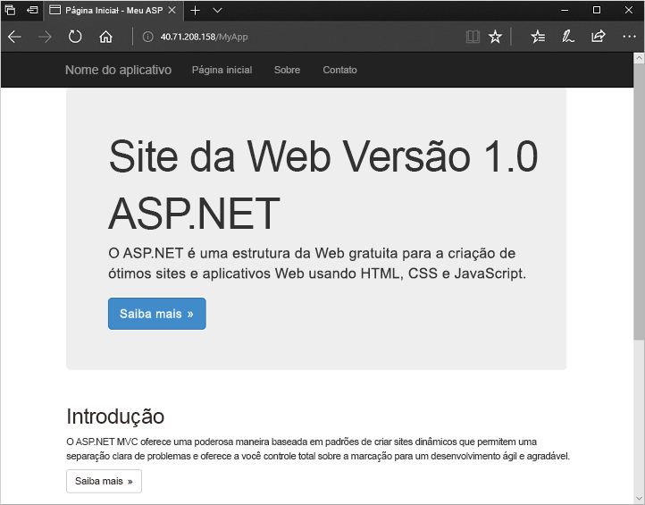

# <a name="quickstart-create-a-virtual-machine-scale-set-with-azure-powershell"></a>Início Rápido: Criar um conjunto de dimensionamento de máquinas virtuais usando o Azure PowerShell


Um conjunto de dimensionamento de máquinas virtuais permite implantar e gerenciar um conjunto de máquinas virtuais idênticas de dimensionamento automático. É possível dimensionar o número de VMs manualmente no conjunto de dimensionamento ou definir as regras para o dimensionamento automático com base no uso de recursos, como CPU, demanda de memória ou tráfego de rede. Um balanceador de carga do Azure então distribui o tráfego para as instâncias de VM no conjunto de dimensionamento. Neste guia de início rápido, você cria um conjunto de dimensionamento de máquinas virtuais e implanta um aplicativo de exemplo com o Azure PowerShell.

Se você não tiver uma assinatura do Azure, crie uma [conta gratuita](https://azure.microsoft.com/free/?WT.mc_id=A261C142F) antes de começar.

[!INCLUDE [cloud-shell-powershell.md](../../includes/cloud-shell-powershell.md)]


## <a name="create-a-scale-set"></a>Criar um conjunto de escala
Crie um conjunto de dimensionamento de máquinas virtuais com [New-AzVmss](/powershell/module/az.compute/new-azvmss). O exemplo a seguir cria um conjunto de dimensionamento chamado *myScaleSet* que usa a imagem da plataforma do *Datacenter do Windows Server 2016*. São criados automaticamente os recursos de rede do Azure para rede virtual, endereço IP público e balanceador de carga. Quando solicitado, você poderá fornecer suas próprias credenciais administrativas para as instâncias de VM no conjunto de dimensionamento:

```azurepowershell-interactive
New-AzVmss `
  -ResourceGroupName "myResourceGroup" `
  -Location "EastUS" `
  -VMScaleSetName "myScaleSet" `
  -VirtualNetworkName "myVnet" `
  -SubnetName "mySubnet" `
  -PublicIpAddressName "myPublicIPAddress" `
  -LoadBalancerName "myLoadBalancer" `
  -UpgradePolicyMode "Automatic"
```

Leva alguns minutos para criar e configurar todos os recursos e as VMs do conjunto de dimensionamento.


## <a name="deploy-sample-application"></a>Implantar um aplicativo de exemplo
Para testar seu conjunto de dimensionamento, instale um aplicativo Web básico. A Extensão de Script Personalizado do Azure para baixar e executar um script que instala o IIS nas instâncias de VM. Essa extensão é útil para a configuração de implantação de postagem, instalação de software ou qualquer outra configuração/tarefa de gerenciamento. Para obter mais informações, consulte a [Visão geral da Extensão de Script Personalizado](../virtual-machines/windows/extensions-customscript.md).

Usar a Extensão de Script Personalizado para instalar um servidor Web IIS básico. Aplique a Extensão do Script Personalizado que instala o IIS da seguinte maneira:

```azurepowershell-interactive
# Define the script for your Custom Script Extension to run
$publicSettings = @{
    "fileUris" = (,"https://raw.githubusercontent.com/Azure-Samples/compute-automation-configurations/master/automate-iis.ps1");
    "commandToExecute" = "powershell -ExecutionPolicy Unrestricted -File automate-iis.ps1"
}

# Get information about the scale set
$vmss = Get-AzVmss `
            -ResourceGroupName "myResourceGroup" `
            -VMScaleSetName "myScaleSet"

# Use Custom Script Extension to install IIS and configure basic website
Add-AzVmssExtension -VirtualMachineScaleSet $vmss `
    -Name "customScript" `
    -Publisher "Microsoft.Compute" `
    -Type "CustomScriptExtension" `
    -TypeHandlerVersion 1.8 `
    -Setting $publicSettings

# Update the scale set and apply the Custom Script Extension to the VM instances
Update-AzVmss `
    -ResourceGroupName "myResourceGroup" `
    -Name "myScaleSet" `
    -VirtualMachineScaleSet $vmss
```

## <a name="allow-traffic-to-application"></a>Permitir o tráfego para o aplicativo

 Para permitir o acesso ao aplicativo Web básico, crie um grupo de segurança de rede com [New-AzNetworkSecurityRuleConfig](/powershell/module/az.network/new-aznetworksecurityruleconfig) e [New-AzNetworkSecurityGroup](/powershell/module/az.network/new-aznetworksecuritygroup). Para saber mais, confira [Rede para os conjuntos de dimensionamento de máquinas virtuais do Azure](virtual-machine-scale-sets-networking.md).

 ```azurepowershell-interactive
 # Get information about the scale set
 $vmss = Get-AzVmss `
             -ResourceGroupName "myResourceGroup" `
             -VMScaleSetName "myScaleSet"

 #Create a rule to allow traffic over port 80
 $nsgFrontendRule = New-AzNetworkSecurityRuleConfig `
   -Name myFrontendNSGRule `
   -Protocol Tcp `
   -Direction Inbound `
   -Priority 200 `
   -SourceAddressPrefix * `
   -SourcePortRange * `
   -DestinationAddressPrefix * `
   -DestinationPortRange 80 `
   -Access Allow

 #Create a network security group and associate it with the rule
 $nsgFrontend = New-AzNetworkSecurityGroup `
   -ResourceGroupName  "myResourceGroup" `
   -Location EastUS `
   -Name myFrontendNSG `
   -SecurityRules $nsgFrontendRule

 $vnet = Get-AzVirtualNetwork `
   -ResourceGroupName  "myResourceGroup" `
   -Name myVnet

 $frontendSubnet = $vnet.Subnets[0]

 $frontendSubnetConfig = Set-AzVirtualNetworkSubnetConfig `
   -VirtualNetwork $vnet `
   -Name mySubnet `
   -AddressPrefix $frontendSubnet.AddressPrefix `
   -NetworkSecurityGroup $nsgFrontend

 Set-AzVirtualNetwork -VirtualNetwork $vnet

 # Update the scale set and apply the Custom Script Extension to the VM instances
 Update-AzVmss `
     -ResourceGroupName "myResourceGroup" `
     -Name "myScaleSet" `
     -VirtualMachineScaleSet $vmss
 ```

## <a name="test-your-scale-set"></a>Testar seu conjunto de dimensionamento
Para ver seu conjunto de dimensionamento em ação, acesse o aplicativo Web de exemplo em um navegador da Web. Obtenha o endereço IP público do balanceador de carga com [Get-AzPublicIpAddress](/powershell/module/az.network/get-azpublicipaddress). O exemplo a seguir exibe o endereço IP criado no grupo de recursos *myResourceGroup*:

```azurepowershell-interactive
Get-AzPublicIpAddress -ResourceGroupName "myResourceGroup" | Select IpAddress
```

Insira o endereço IP público do balanceador de carga em um navegador da Web. O balanceador de carga distribui o tráfego para uma de suas instâncias de VM, conforme mostrado no exemplo a seguir:




## <a name="clean-up-resources"></a>Limpar recursos
Quando não for mais necessário, será possível usar o [Remove-AzResourceGroup](/powershell/module/az.resources/remove-azresourcegroup) para remover o grupo de recursos, o conjunto de dimensionamento e todos os recursos relacionados conforme descrito a seguir. O parâmetro `-Force` confirma que você deseja excluir os recursos sem um prompt adicional para fazer isso. O parâmetro `-AsJob` retorna o controle ao prompt sem aguardar a conclusão da operação.

```azurepowershell-interactive
Remove-AzResourceGroup -Name "myResourceGroup" -Force -AsJob
```


## <a name="next-steps"></a>Próximas etapas
Neste início rápido, você criou um conjunto de dimensionamento básico e usou uma Extensão de Script Personalizado para instalar um servidor Web IIS básico nas instâncias de VM. Para saber mais, siga para o tutorial sobre como criar e gerenciar um conjunto de dimensionamento de máquinas virtuais do Azure.

> [!div class="nextstepaction"]
> [Criar e gerenciar um conjunto de dimensionamento de máquinas virtuais do Azure](tutorial-create-and-manage-powershell.md)
