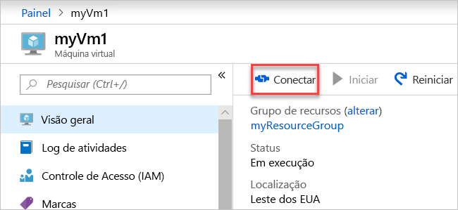

# <a name="quickstart-create-a-virtual-network-using-the-azure-portal"></a>Início Rápido: criar uma rede virtual usando o Portal do Azure

Uma rede virtual permite que recursos do Azure, como VMs (máquinas virtuais), comuniquem-se em modo privado e com a Internet. Neste início rápido, você aprende como criar uma rede virtual. Após criar uma rede virtual, você implantará duas VMs na rede virtual. Em seguida, você irá conectar uma VM a partir da Internet e executar comunicação entre duas VMs em modo privado.

Se você não tiver uma assinatura do Azure, crie uma [conta gratuita](https://azure.microsoft.com/free/?WT.mc_id=A261C142F) antes de começar.

## <a name="log-in-to-azure"></a>Fazer logon no Azure 

Faça logon no Portal do Azure em https://portal.azure.com.

## <a name="create-a-virtual-network"></a>Criar uma rede virtual

1. Selecione **Criar um recurso** no canto superior esquerdo do Portal do Azure.
2. Selecione **Rede** e, sem seguida, selecione **Rede Virtual**.
3. Insira, ou selecione, as informações a seguir, aceite os padrões para as configurações restantes e, em seguida, selecione **Criar**:

    |Configuração|Valor|
    |---|---|
    |NOME|myVirtualNetwork|
    |Assinatura| Selecione sua assinatura.|
    |Grupo de recursos| Selecione **Criar novo** e insira *myResourceGroup*.|
    |Local padrão| Selecione **Leste dos EUA**.|

    

## <a name="create-virtual-machines"></a>Criar máquinas virtuais

Crie duas VMs na rede virtual:

### <a name="create-the-first-vm"></a>Criar a primeira VM

1. Selecione **+ Criar um recurso** localizado no canto superior esquerdo do Portal do Azure.
2. Selecione **Computação** e, em seguida, selecione **Windows Server 2016 Datacenter**.
3. Insira, ou selecione, as informações a seguir, aceite os padrões para as configurações restantes e, em seguida, selecione **OK**:

    |Configuração|Valor|
    |---|---|
    |NOME|myVm1|
    |Nome de usuário| Insira um nome de usuário de sua escolha.|
    |Senha| Insira uma senha de sua escolha. A senha deve ter no mínimo 12 caracteres e atender a [requisitos de complexidade definidos](../virtual-machines/windows/faq.md?toc=%2fazure%2fvirtual-network%2ftoc.json#what-are-the-password-requirements-when-creating-a-vm).|
    |Assinatura| Selecione sua assinatura.|
    |Grupo de recursos| Selecione **Usar existente** e, em seguida, **myResourceGroup**.|
    |Local padrão| Selecione **Leste dos EUA**|

    

4. Selecione um tamanho para a VM e selecione **Selecionar**.
5. Em **Configurações**, aceitar todos os padrões e, em seguida, selecione **OK**.

    

6. Em **Criar** do **Resumo**, selecione **Criar** para iniciar a implantação da VM. A VM demora alguns minutos para implantar. 

### <a name="create-the-second-vm"></a>Criar a segunda VM

Conclua as etapas de 1 a 6 novamente, mas, na etapa 3 nomeie a VM *myVm2*.

## <a name="connect-to-a-vm-from-the-internet"></a>Conecte uma VM a partir da Internet

1. Depois que *myVm1* for criada, conecte-a. Na parte superior do Portal do Azure, digite *myVm1*. Selecione **myVm1** quando aparecer nos resultados da pesquisa. Selecione o botão **Conectar**.

    

2. Após selecionar o botão **Conectar**, um arquivo Remote Desktop Protocol (.rdp) será criado e baixado no computador.  
3. Abra o arquivo rdp baixado. Se solicitado, selecione **Conectar**. Insira o nome de usuário e senha que você especificou ao criar a VM. Talvez seja necessário selecionar **Mais escolhas** e, em seguida, **Usar uma conta diferente** para especificar as credenciais inseridas durante a criação da VM. 
4. Selecione **OK**.
5. Você pode receber um aviso do certificado durante o processo de logon. Se você receber o aviso, selecione **Sim** ou **Continuar**, para prosseguir com a conexão.

## <a name="communicate-between-vms"></a>Comunicação entre VMs

1. A partir do PowerShell, insira `ping myvm2`. O ping falha porque ele usa o protocolo ICMP e, por padrão, o ICMP não é permitido através do firewall do Windows.
2. Para permitir ping de *myVm2* para *myVm1* em uma etapa posterior, insira o comando do PowerShell a seguir, que permite a entrada de ICMP através do firewall do Windows:

    ```powershell
    New-NetFirewallRule –DisplayName “Allow ICMPv4-In” –Protocol ICMPv4
    ```

3. Feche a conexão da área de trabalho remota para *myVm1*. 

4. Complete as etapas em [Conecte uma VM a partir da Internet](#connect-to-a-vm-from-the-internet) novamente, mas conecte para *myVm2*. Em um prompt de comando, insira `ping myvm1`.

    Você recebe respostas de *myVm1*, porque você permitiu ICMP através do firewall do Windows na VM *myVm1* em uma etapa anterior.

5. Feche a conexão da área de trabalho remota para *myVm2*.

## <a name="clean-up-resources"></a>Limpar recursos

Quando não for mais necessário, exclua o grupo de recursos e todos os recursos que ele contém:

1. Insira *myResourceGroup* na caixa **Pesquisar** na parte superior do portal. Quando aparecer **myResourceGroup** nos resultados da pesquisa, selecione-o.
2. Selecione **Excluir grupo de recursos**.
3. Insira *myResourceGroup* para **DIGITAR O NOME DO GRUPO DE RECURSOS:** e selecione **Excluir**.

## <a name="next-steps"></a>Próximas etapas

Neste início rápido, você criou uma rede virtual padrão e duas VMs. Você se conectou a uma VM a partir da Internet e fez comunicação entre esta e outra VM em modo privado. Para saber mais sobre configurações de rede virtual, consulte [Gerenciar uma rede virtual](manage-virtual-network.md).

Por padrão, o Azure permite comunicação privada irrestrita entre VMs, mas só permite conexões de área de trabalho remota de entrada para VMs do Windows a partir da Internet. Para saber como permitir ou restringir diferentes tipos de comunicação de rede de e para VMs, siga até o tutorial sobre [Filtrar tráfego](tutorial-filter-network-traffic.md).