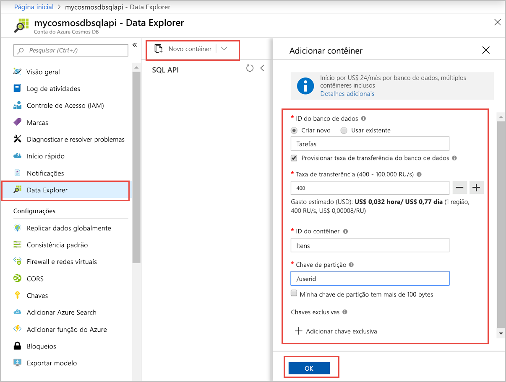

Agora, você pode usar a ferramenta Data Explorer no Portal do Azure para criar um banco de dados e uma coleção. 

1. Clique em **Data Explorer** > **Nova Coleção**. 
    
    A área **Adicionar Coleção** é exibida à direita, talvez seja necessário rolar para a direita para vê-la.

    

2. Na página **Adicionar coleção**, insira as configurações da nova coleção.

    Configuração|Valor sugerido|DESCRIÇÃO
    ---|---|---
    ID do banco de dados|Tarefas|Digite *Tarefas* como o nome do novo banco de dados. Os nomes de banco de dados devem conter de 1 a 255 caracteres e não podem conter /, \\, #, ?, ou um espaço à direita.
    ID da coleção|Itens|Insira *Itens* como o nome da nova coleção. As IDs de coleção têm os mesmos requisitos de caracteres que os nomes de banco de dados.
    Capacidade de armazenamento| Fixo (10 GB)|Use o valor padrão de **Fixo (10 GB)**. Esse valor é a capacidade de armazenamento do banco de dados.
    Throughput|400 RU|Altere a taxa de transferência para 400 unidades de solicitação por segundo (RU/s). A capacidade de armazenamento deve ser definida como **Fixa (10 GB)** para definir a taxa de transferência para 400 RU/s. Se quiser reduzir a latência, você poderá escalar verticalmente a taxa de transferência mais tarde. 
    
    Além das configurações anteriores, você pode opcionalmente adicionar **Chaves exclusivas** à coleção. Vamos deixar o campo vazio neste exemplo. As chaves exclusivas oferecem aos desenvolvedores a capacidade de adicionar uma camada de integridade dos dados ao seu banco de dados. Ao criar uma política de chave exclusiva durante a criação de uma coleção, você garante a exclusividade de um ou mais valores por chave de partição. Para obter mais informações, consulte o artigo [Chaves exclusivas no Azure Cosmos DB](../articles/cosmos-db/unique-keys.md).
    
    Clique em **OK**.

    O Data Explorer exibe o novo banco de dados e a coleção.

    