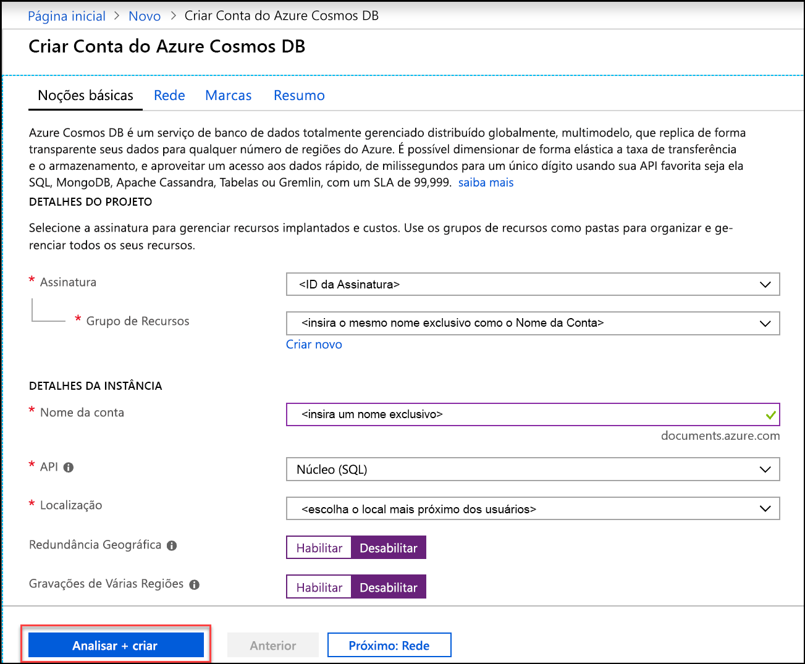
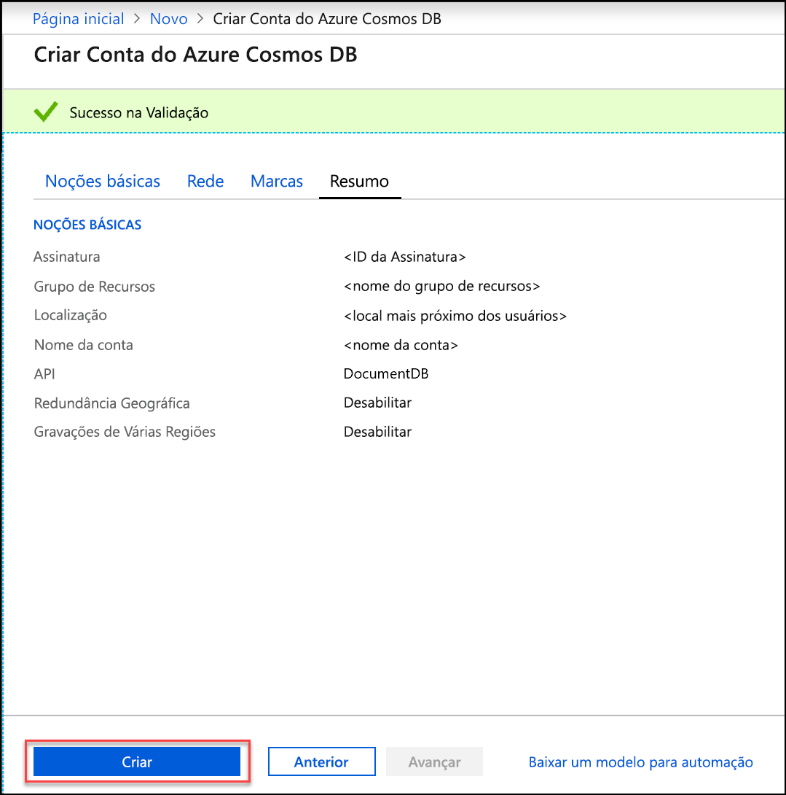
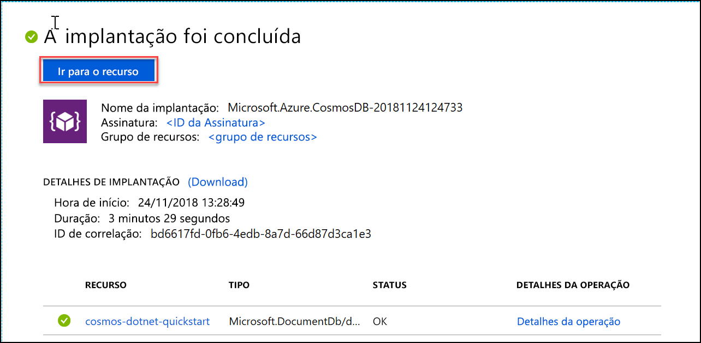

1. Em uma nova janela do navegador, entre no [Portal do Azure](https://portal.azure.com/).
2. Clique em **Criar um recurso** > **Bancos de dados** > **Azure Cosmos DB**.
   
   

3. Na página **Criar Conta do Azure Cosmos DB**, insira as configurações da nova conta do Azure Cosmos DB. 
 
    Configuração|Valor|DESCRIÇÃO
    ---|---|---
    Assinatura|*Sua assinatura*|Selecione a assinatura do Azure que você deseja usar para essa conta do Azure Cosmos DB. 
    Grupo de recursos|Criar Novo  *Insira um nome exclusivo*|Selecione **Criar Novo**, em seguida, insira um novo nome de grupo de recursos para sua conta. Para simplificar, você pode usar um nome igual ao Nome da Conta. 
    Nome da conta|*Insira um nome exclusivo*|Insira um nome exclusivo para identificar a conta do Azure Cosmos DB. Como *documents.Azure.com* é acrescentado à ID que você fornece para criar o URI, use uma ID exclusiva.  A ID pode conter apenas letras minúsculas, números e hifens (-), e deve conter de 3 a 31 caracteres.
    API|Núcleo (SQL)|A API determina o tipo de conta a ser criada. O Azure Cosmos DB fornece cinco APIs: SQL (banco de dados do documento), Gremlin (banco de dados de grafo), MongoDB (banco de dados do documento), API de Tabela e API do Cassandra. No momento, cada API requer que você crie uma conta separada.   Selecione **Núcleo (SQL)** porque neste artigo você criará um banco de dados de documentos e fará consultas usando a sintaxe SQL.   [Saiba mais sobre a API SQL](../articles/cosmos-db/documentdb-introduction.md)|
    Local padrão|*Selecione a região mais próxima de seus usuários*|Selecione uma localização geográfica para hospedar a sua conta do Azure Cosmos DB. Use o local mais próximo dos usuários para fornecer a eles acesso mais rápido aos dados.
    Habilitar a redundância geográfica| Deixar em branco | Isso cria uma versão replicada do banco de dados em uma segunda região (par). Deixe em branco.  
    Gravações de várias regiões| Deixar em branco | Isso permite que cada uma das suas regiões de banco de dados seja uma região de leitura e gravação. Deixe em branco.  

    Em seguida clique em **Revisar + criar**. Você pode ignorar as seções **Rede** e **Marcas**. 

    

    Examine as informações de resumo e clique em **Criar**. 

    

4. A criação da conta leva alguns minutos. Aguarde até o portal exibir a mensagem **Sua implantação foi concluída** e clique em **Ir para o recurso**.     

    

5. Aguarde até o portal exibir **Parabéns! Sua conta do Azure Cosmos DB foi criada**.

    

