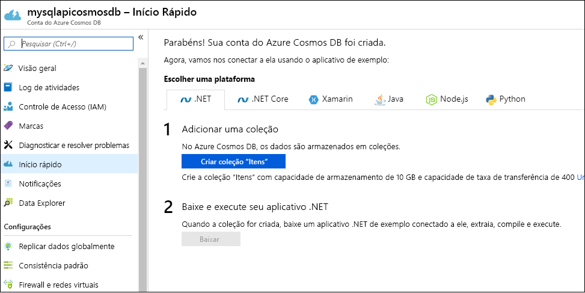

1. Vá para o [portal do Azure](https://portal.azure.com/) para criar uma conta do Azure Cosmos DB. Pesquise pelo **Azure Cosmos DB** e selecione-o.

   

1. Selecione **Adicionar**.
1. Na página **Criar Conta do Azure Cosmos DB**, insira as configurações básicas da nova conta do Azure Cosmos. 

    |Configuração|Valor|DESCRIÇÃO |
    |---|---|---|
    |Subscription|Nome da assinatura|Selecione a assinatura do Azure que você deseja usar para essa conta do Azure Cosmos. |
    |Grupo de recursos|Nome do grupo de recursos|Selecione um grupo de recursos ou selecione **Criar novo**, então insira um nome exclusivo para o novo grupo de recursos. |
    |Nome da conta|Um nome exclusivo|Insira um nome para identificar a conta do Azure Cosmos. Como *documents.Azure.com* é acrescentado à ID que você fornece para criar o URI, use uma ID exclusiva.  A ID pode conter apenas letras minúsculas, números e o caractere de hífen (-). Ela deve ter entre 3 e 31 caracteres.|
    |API|O tipo de conta a ser criada|Selecione **Núcleo (SQL)** para criar uma consulta e um banco de dados de documento usando a sintaxe SQL.   A API determina o tipo de conta a ser criada. O Azure Cosmos DB fornece cinco APIs: Núcleo (SQL) e MongoDB para dados de documento, Gremlin para dados de grafo, Tabela do Azure e Cassandra. No momento, você deve criar uma conta separada para cada API.   [Saiba mais sobre a API do SQL](../articles/cosmos-db/documentdb-introduction.md).|
    |Location|A região mais próxima dos usuários|Selecione uma localização geográfica para hospedar a sua conta do Azure Cosmos DB. Use a localização mais próxima dos usuários para fornecer a eles acesso mais rápido aos dados.|

   

1. Selecione **Examinar + criar**. Você pode ignorar as seções **Rede** e **Marcas**.

1. Examine as configurações da conta e selecione **Criar**. São necessários alguns minutos para criar a conta. Aguarde até que a página do portal exiba **Sua implantação está concluída**. 

    

1. Selecione **Ir para recurso** para ir para a página da conta do Azure Cosmos DB. 

    
