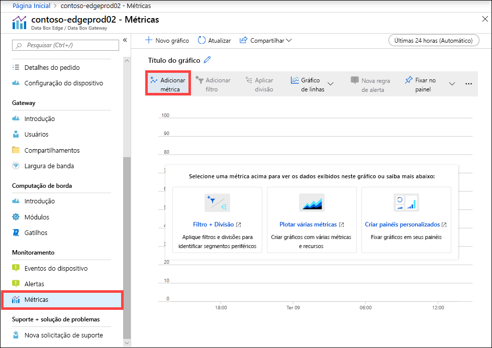
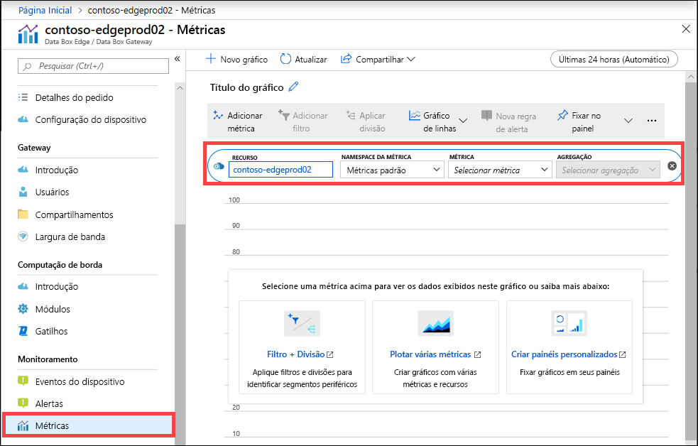
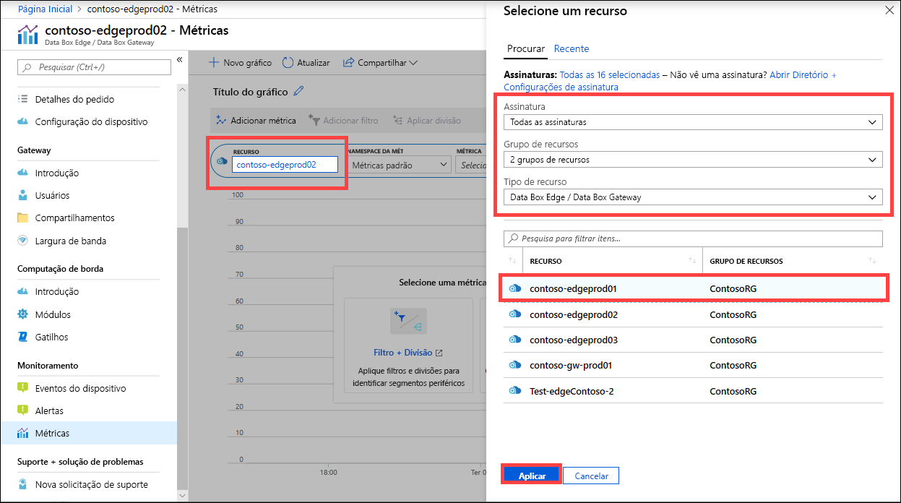

Exiba também as métricas para monitorar o desempenho do dispositivo e, em alguns casos, para solução de problemas do dispositivo.

Execute as etapas a seguir no portal do Azure para criar um gráfico para as métricas do dispositivo selecionadas.

1. Para ver seu recurso no portal do Azure, acesse **Monitoramento > Métricas** e selecione **Adicionar métrica**.

    

2. O recurso é populado automaticamente.  

    

    Para especificar outro recurso, selecione o recurso. Na folha **Selecionar um recurso**, selecione a assinatura, o grupo de recursos, o tipo de recurso e o recurso específico para o qual deseja mostrar as métricas e selecione **Aplicar**.

    

3. Na lista suspensa, selecione uma métrica para monitorar seu dispositivo. As métricas podem ser **Métricas de capacidade** ou **Métricas de transação**. As métricas de capacidade estão relacionadas à capacidade do dispositivo. As métricas de transação estão relacionadas a operações de leitura e gravação no Armazenamento do Azure.

    |Métricas de capacidade                     |DESCRIÇÃO  |
    |-------------------------------------|-------------|
    |**Capacidade disponível**               | Refere-se ao tamanho dos dados que podem ser gravados no dispositivo. Em outras palavras, essa é a capacidade que pode ser disponibilizada no dispositivo.   Libere a capacidade do dispositivo excluindo a cópia local dos arquivos que têm uma cópia no dispositivo, bem como na nuvem.        |
    |**Capacidade total**                   | Refere-se ao total de bytes no dispositivo no qual os dados serão gravados. Isso também é chamado de tamanho total do cache local.    Agora você pode aumentar a capacidade de um dispositivo virtual existente adicionando um disco de dados. Adicione um disco de dados por meio do gerenciamento do hipervisor à VM e, em seguida, reinicie a VM. O pool de armazenamento local do dispositivo de gateway será expandido para acomodar o disco de dados recém-adicionado.   Para obter mais informações, acesse [Adicionar um disco rígido a uma máquina virtual do Hyper-V](https://www.youtube.com/watch?v=EWdqUw9tTe4). |
    
    |Métricas de transação              | DESCRIÇÃO         |
    |-------------------------------------|---------|
    |**Bytes carregados na nuvem (dispositivo)**    | Soma de todos os bytes carregados em todos os compartilhamentos no dispositivo        |
    |**Bytes carregados na nuvem (compartilhamento)**     | Bytes carregados por compartilhamento. Isso pode ser:    Méd., que é a (Soma de todos os bytes carregados por compartilhamento/Número de compartilhamentos)    Máx., que é o número máximo de bytes carregados de um compartilhamento   Mín., que é o número mínimo de bytes carregados de um compartilhamento      |
    |**Taxa de transferência de downloads na nuvem (compartilhamento)**| Bytes baixados por compartilhamento. Isso pode ser:    Méd., que é a (Soma de todos os bytes lidos ou baixados em um compartilhamento/Número de compartilhamentos)    Máx., que é o número máximo de bytes baixados de um compartilhamento   e Mín., que é o número mínimo de bytes baixados de um compartilhamento  |
    |**Taxa de transferência de leituras na nuvem**            | Soma de todos os bytes lidos na nuvem em todos os compartilhamentos no dispositivo     |
    |**Taxa de transferência de uploads na nuvem**          | Soma de todos os bytes gravados na nuvem em todos os compartilhamentos no dispositivo     |
    |**Taxa de transferência de uploads na nuvem (compartilhamento)**  | Soma de todos os bytes gravados na nuvem de um compartilhamento/nº de compartilhamentos é média, máx. e mín. por compartilhamento      |
    |**Taxa de transferência da leituras (rede)**           | Inclui a taxa de transferência de rede do sistema para todos os bytes lidos na nuvem. Essa exibição pode incluir dados que não são restritos aos compartilhamentos.   A separação mostrará o tráfego em todos os adaptadores de rede no dispositivo. Isso inclui adaptadores que não estão conectados nem habilitados.      |
    |**Taxa de transferência de gravações (rede)**       | Inclui a taxa de transferência de rede do sistema para todos os bytes gravados na nuvem. Essa exibição pode incluir dados que não são restritos aos compartilhamentos.   A separação mostrará o tráfego em todos os adaptadores de rede no dispositivo. Isso inclui adaptadores que não estão conectados nem habilitados.          |
    |**Computação de borda – uso de memória**      | Essa métrica não é aplicável ao Data Box Gateway e, portanto, não é populada.          |
    |**Computação de borda – percentual de CPU**    | Essa métrica não é aplicável ao Data Box Gateway e, portanto, não é populada.         |

4. Quando uma métrica é selecionada na lista suspensa, a agregação também pode ser definida. Agregação refere-se ao valor real agregado em um período de tempo especificado. Os valores agregados podem ser a média, o valor mínimo ou o valor máximo. Selecionar Méd., Máx. ou Mín. para a agregação

    

5. Se a métrica selecionada tiver várias instâncias, a opção de separação estará disponível. Selecione **Aplicar separação** e, em seguida, selecione o valor pelo qual deseja ver o detalhamento.

    

6. Caso deseje ver agora o detalhamento somente de algumas instâncias, filtre os dados. Por exemplo, nesse caso, caso deseje ver a taxa de transferência de rede somente para os dois adaptadores de rede conectados no dispositivo, filtre esses adaptadores. Selecione **Adicionar filtro** e especifique o nome do adaptador de rede para filtragem.

    

7. Você também pode fixar o gráfico no painel para facilitar o acesso.

    

8. Para exportar os dados do gráfico para uma planilha do Excel ou obter um link para o gráfico que pode ser compartilhado, selecione a opção de compartilhamento na barra de comandos.

    