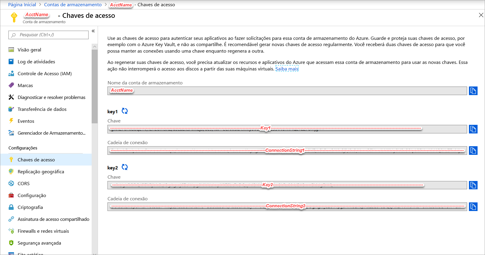
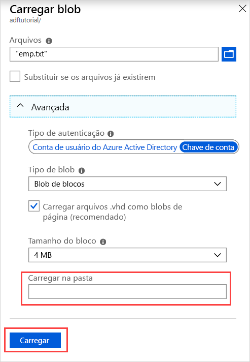

## <a name="prerequisites"></a>Pré-requisitos

### <a name="azure-subscription"></a>Assinatura do Azure
Se você não tiver uma assinatura do Azure, crie uma [conta gratuita](https://azure.microsoft.com/free/) antes de começar.

### <a name="azure-roles"></a>Funções do Azure
Para criar instâncias de Data Factory, a conta de usuário usada para entrar no Azure deve ser um membro das funções *colaborador* ou *proprietário*, ou um *administrador* da assinatura do Azure. Para exibir as permissões que você tem na assinatura, portal do Azure, selecione seu nome de usuário no canto superior direito e selecione **Permissões**. Se tiver acesso a várias assinaturas, selecione a que for adequada. 

Para criar e gerenciar recursos filho para o Data Factory – incluindo conjuntos de dados, serviços vinculados, pipelines, gatilhos e tempos de execução de integração –, os requisitos a seguir são aplicáveis:
- Para criar e gerenciar recursos filho no portal do Azure, você precisa pertencer à função **Colaborador do Data Factory** no nível do grupo de recursos ou superior.
- Para criar e gerenciar recursos filho com o PowerShell ou o SDK, a função de **colaborador** no nível do recurso ou superior é suficiente.

Para obter instruções de exemplo sobre como adicionar um usuário a uma função, confira o artigo [Adicionar funções](../articles/billing/billing-add-change-azure-subscription-administrator.md).

Para obter mais informações, confira os seguintes artigos:
- [Função Colaborador do Data Factory](../articles/role-based-access-control/built-in-roles.md#data-factory-contributor)
- [Funções e permissões para o Azure Data Factory](../articles/data-factory/concepts-roles-permissions.md)

### <a name="azure-storage-account"></a>Conta de Armazenamento do Azure
Use uma Conta de Armazenamento do Azure de uso geral (especificamente o Armazenamento de Blobs) como armazenamento de dados de *origem* e *destino* neste guia de início rápido. Se você não tiver uma conta de fins gerais de armazenamento do Azure, consulte [Criar uma conta de armazenamento](../articles/storage/common/storage-quickstart-create-account.md) para criar uma. 

#### <a name="get-the-storage-account-name-and-account-key"></a>Obter o nome da conta de armazenamento e a chave da conta
Você precisará do nome e da chave de sua conta de armazenamento do Azure neste início rápido. O procedimento a seguir fornece as etapas para obter o nome e a chave da sua conta de armazenamento: 

1. Em um navegador Web, acesse o [portal do Azure](https://portal.azure.com). Conecte-se usando seu nome de usuário e senha do Azure. 
2. Selecione **Todos os serviços** no menu esquerdo, filtre pela palavra-chave **Armazenamento** e selecione **Contas de armazenamento**.

   
3. Na lista de contas de armazenamento, filtre pela sua conta de armazenamento (se necessário) e, em seguida, selecione a sua conta de armazenamento. 
4. Na página da **Conta de armazenamento**, selecione **Chaves de acesso** no menu.

   
5. Copie os valores para as caixas **Nome da conta de armazenamento** e **chave1** para a área de transferência. Cole-os em um Bloco de notas ou qualquer outro editor e salve-os. Você pode usá-los mais tarde neste guia de início rápido.   

#### <a name="create-the-input-folder-and-files"></a>Criar os arquivos e pasta de entrada
Nesta seção, você cria um contêiner de blobs chamado **adftutorial** no armazenamento de Blobs do Azure. Você cria uma pasta chamada **entrada** no contêiner e, em seguida, carrega um arquivo de exemplo na pasta de entrada. 

1. Na janela **Conta de armazenamento**, alterne para **Visão geral** e depois selecione **Blobs**. 

   
2. Na página **Serviço Blob**, selecione **+ Contêiner** na barra de ferramentas. 

       
3. Na caixa de diálogo **Novo contêiner**, insira **adftutorial** como o nome e selecione **OK**. 

   
4. Selecione **adftutorial** na lista de contêineres. 

   
5. Na página **Contêiner**, selecione **Carregar** na barra de ferramentas.  

   
6. Na página **Carregar blob**, selecione **Avançado**.

   
7. Inicie o **Bloco de notas** e crie um arquivo chamado **emp.txt** com o seguinte conteúdo. Salve-o na pasta **c:\ADFv2QuickStartPSH**. Crie a pasta **ADFv2QuickStartPSH** se ela ainda não existir.
    
   ```
   John, Doe
   Jane, Doe
   ```    
8. No Portal do Azure, na página **Carregar blob**, procure e selecione o arquivo **emp.txt** para a caixa **Arquivos**. 
9. Insira **entrada** como um valor da caixa **Carregar para a pasta**. 

        
10. Confirme que a pasta é **entrada** e o arquivo é **emp.txt** e selecione **Carregar**.
    
    O arquivo **emp.txt** e o status do carregamento devem estar na lista. 
12. Feche a página **Carregar blob** clicando no **X** no canto superior. 

    
1. Mantenha a página **Contêiner** aberta. Você a usa para verificar a saída no final do guia de início rápido.