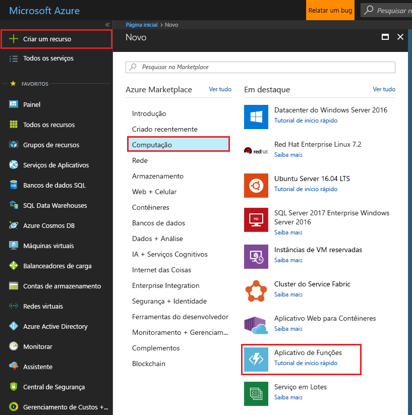
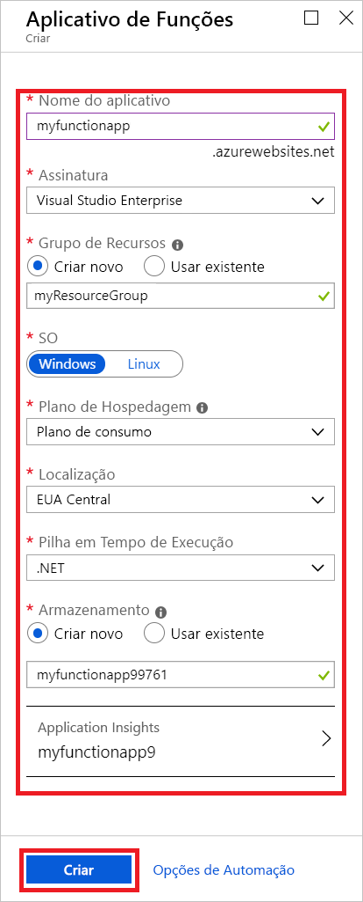

1. Selecione o botão **Novo** no canto superior esquerdo do portal do Azure, e selecione **Computação** > **Aplicativo de funções**. 

    

2. Use as configurações do aplicativo de funções especificadas na tabela abaixo da imagem.

    

    | Configuração      | Valor sugerido  | DESCRIÇÃO                                        |
    | ------------ |  ------- | -------------------------------------------------- |
    | **Nome do aplicativo** | Nome globalmente exclusivo | Nome que identifica seu novo aplicativo de funções. Os caracteres válidos são `a-z`, `0-9` e `-`.  | 
    | **Assinatura** | Sua assinatura | A assinatura na qual este novo aplicativo de funções será criado. | 
    | **[Grupo de Recursos](../articles/azure-resource-manager/resource-group-overview.md)** |  myResourceGroup | Nome do novo grupo de recursos no qual criar o seu aplicativo de funções. | 
    | **SO** | Windows | A hospedagem sem servidor no momento só está disponível quando executada no Windows. Para a hospedagem Linux, consulte [Criar sua primeira função em execução no Linux usando a CLI do Azure](../articles/azure-functions/functions-create-first-azure-function-azure-cli-linux.md). |
    | **[Plano de hospedagem](../articles/azure-functions/functions-scale.md)** | Plano de consumo | Plano de hospedagem que define como os recursos são alocados para seu aplicativo de funções. No **Plano de Consumo** padrão, os recursos são adicionados dinamicamente conforme exigido por suas funções. Nesta hospedagem [sem servidor](https://azure.microsoft.com/overview/serverless-computing/), você só paga pelo tempo durante o qual suas funções são executadas. Quando você executa em um Plano do Serviço de Aplicativo, deve gerenciar o [dimensionamento do aplicativo de funções](../articles/azure-functions/functions-scale.md).  |
    | **Localidade** | Europa Ocidental | Escolha uma [região](https://azure.microsoft.com/regions/) perto de você ou perto de outros serviços que suas funções acessam. |
    | **[Conta de armazenamento](../articles/storage/common/storage-quickstart-create-account.md)** |  Nome globalmente exclusivo |  Nome da nova conta de armazenamento usada pelo seu aplicativo de funções. Os nomes da conta de armazenamento devem ter entre 3 e 24 caracteres e podem conter apenas números e letras minúsculas. Você também pode usar uma conta existente, mas ela precisa atender aos [requisitos da conta de armazenamento](../articles/azure-functions/functions-scale.md#storage-account-requirements). |

3. Selecione **Criar** para provisionar e implantar o aplicativo de funções.

4. Selecione o ícone da Notificação no canto superior direito do portal e veja se a mensagem **Implantação concluída com êxito** é exibida. 

    

5. Selecione **Ir para recursos** para exibir o novo aplicativo de funções.

> [!TIP]
> Se tiver problemas para localizar seus aplicativos de funções no portal, tente [adicionar os Aplicativos de funções aos seus favoritos no portal do Azure](../articles/azure-functions/functions-how-to-use-azure-function-app-settings.md#favorite).   
