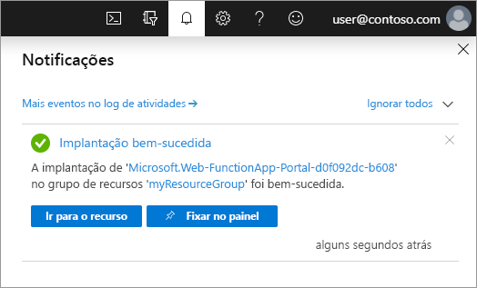

1. No menu do portal do Azure, selecione **Criar um recurso**.

    

1. Na página **Novo**, selecione **Computação** > **Aplicativo de Funções**.

1. Use as configurações do aplicativo de funções especificadas na tabela abaixo da imagem.

    

    | Configuração      | Valor sugerido  | DESCRIÇÃO |
    | ------------ | ---------------- | ----------- |
    | **Assinatura** | Sua assinatura | A assinatura na qual este novo aplicativo de funções será criado. |
    | **[Grupo de Recursos](../articles/azure-resource-manager/resource-group-overview.md)** |  *myResourceGroup* | Nome do novo grupo de recursos no qual criar o seu aplicativo de funções. |
    | **Nome do aplicativo de funções** | Nome globalmente exclusivo | Nome que identifica seu novo aplicativo de funções. Os caracteres válidos são `a-z` (não diferencia maiúsculas de minúsculas), `0-9` e `-`.  |
    |**Publicar**| Código | Opção para publicar arquivos de código ou um contêiner do Docker. |
    | **Pilha de runtime** | Linguagem preferencial | Escolha um runtime compatível com sua linguagem de programação de funções favorita. Escolha **.NET** para funções C# e F#. |
    |**Região**| Região preferencial | Escolha uma [região](https://azure.microsoft.com/regions/) perto de você ou perto de outros serviços que suas funções acessam. |

    Selecione o botão **Avançar: Hospedagem >** .

1. Insira as configurações a seguir para a hospedagem.

    

    | Configuração      | Valor sugerido  | DESCRIÇÃO |
    | ------------ | ---------------- | ----------- |
    | **[Conta de armazenamento](../articles/storage/common/storage-quickstart-create-account.md)** |  Nome globalmente exclusivo |  Crie uma conta de armazenamento usada pelo seu aplicativo de funções. Os nomes da conta de armazenamento devem ter entre 3 e 24 caracteres e podem conter apenas números e letras minúsculas. Use também uma conta existente, que precisará atender aos [requisitos da conta de armazenamento](../articles/azure-functions/functions-scale.md#storage-account-requirements). |
    |**Sistema operacional**| Sistema operacional preferencial | Um sistema operacional é pré-selecionado para você com base na seleção da pilha de runtime, mas você pode alterar a configuração, se necessário. |
    | **[Plano](../articles/azure-functions/functions-scale.md)** | Plano de consumo | Plano de hospedagem que define como os recursos são alocados para seu aplicativo de funções. No **Plano de Consumo** padrão, os recursos são adicionados dinamicamente conforme exigido por suas funções. Nesta hospedagem [sem servidor](https://azure.microsoft.com/overview/serverless-computing/), você só paga pelo tempo durante o qual suas funções são executadas. Quando você executa em um Plano do Serviço de Aplicativo, deve gerenciar o [dimensionamento do aplicativo de funções](../articles/azure-functions/functions-scale.md).  |

    Selecione o botão **Avançar: Monitoramento >** .

1. Insira as configurações a seguir para o monitoramento.

    

    | Configuração      | Valor sugerido  | DESCRIÇÃO |
    | ------------ | ---------------- | ----------- |
    | **[Application Insights](../articles/azure-functions/functions-monitoring.md)** | Padrão | Cria um recurso do Application Insights do mesmo *nome do aplicativo* na região com suporte mais próxima. Ao expandir essa configuração, você pode alterar o **Novo nome do recurso** ou escolher um **Local** diferente em uma [geografia do Azure](https://azure.microsoft.com/global-infrastructure/geographies/) onde deseja armazenar seus dados. |

    Selecione **Examinar + Criar** para examinar as seleções de configuração de aplicativo.

1. Selecione **Criar** para provisionar e implantar o aplicativo de funções.

1. Selecione o ícone da Notificação no canto superior direito do portal e veja se a mensagem **Implantação concluída com êxito** é exibida.

    

1. Selecione **Ir para recursos** para exibir o novo aplicativo de funções. Você também pode selecionar **Fixar no painel**. A fixação torna mais fácil retornar a esse recurso de aplicativo de função no seu painel.
