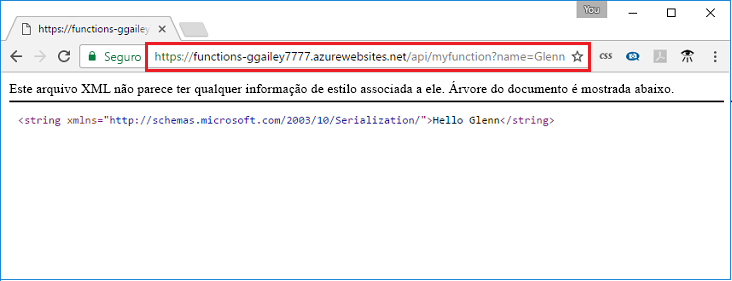

## <a name="test"></a>Testar a função

Use o cURL para testar a função implantada em um computador Mac ou Linux, ou usando Bash no Windows. Execute o seguinte comando cURL, substituindo o espaço reservado `<app_name>` pelo nome do aplicativo de funções. Acrescente a cadeia de caracteres de consulta `&name=<yourname>` à URL.

```bash
curl https://<app_name>.azurewebsites.net/api/MyHttpTrigger?name=<yourname>
```  

  

Caso não tenha o cURL disponível na linha de comando, digite a mesma URL no endereço do seu navegador da Web. Novamente, substitua o espaço reservado `<app_name>` pelo nome do aplicativo de funções, e acrescente a cadeia de consulta `&name=<yourname>` à URL e execute a solicitação.

    https://<app_name>.azurewebsites.net/api/MyHttpTrigger?name=<yourname>
   
  
