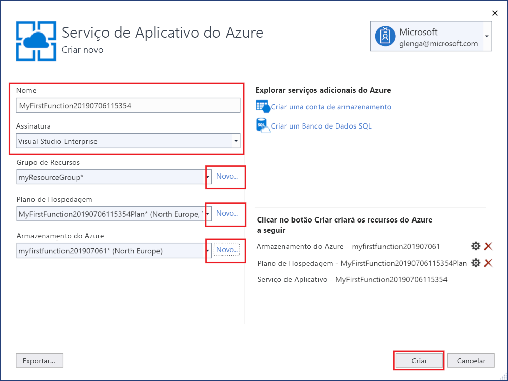

1. No **Gerenciador de Soluções**, clique com o botão direito do mouse no nome do projeto e selecione **Publicar**.

2. Na caixa de diálogo **Selecione um destino de publicação**, use as opções publicar, conforme especificado na tabela embaixo da imagem: 

    

    | Opção      | DESCRIÇÃO                                |
    | ------------ |  -------------------------------------------------- |
    | **Plano de consumo do Azure Functions** |   Quando você publica seu projeto em um aplicativo de funções executado em um [Plano de consumo](../articles/azure-functions/functions-scale.md#consumption-plan), você paga apenas pelas execuções do seu aplicativo de funções. Outros planos de hospedagem incorrem em custos mais altos. Para saber mais, confira [Escala e hospedagem do Azure Functions](../articles/azure-functions/functions-scale.md). | 
    | **Criar novo** | Um novo aplicativo de funções com recursos relacionados é criado no Azure. Quando você escolhe **selecionar existente**, todos os arquivos no aplicativo de funções existente no Azure são substituídos pelos arquivos do projeto local. Use essa opção somente quando republicar atualizações para um aplicativo de funções existente. |
    | **Executar com base no arquivo de pacote** | Seu aplicativo de funções é implantado usando a [Implantação de Zip](../articles/azure-functions/functions-deployment-technologies.md#zip-deploy) com o modo [Run-From-Package](../articles/azure-functions/run-functions-from-deployment-package.md) habilitado. Essa é a maneira recomendada de executar suas funções, que resulta em um melhor desempenho. Quando não estiver usando essa opção, verifique se você interrompeu a execução local do projeto de aplicativo de funções antes de publicar no Azure. |

3. Selecione **Publicar**. Se você ainda não entrou em sua conta do Azure do Visual Studio, selecione **Entrar**. Também é possível criar uma conta gratuita do Azure.

4. No **Serviço de Aplicativo: Criar**, use as configurações de **Hospedagem** conforme especificadas na tabela embaixo da imagem:

    

    | Configuração      | Valor sugerido  | Descrição                                |
    | ------------ |  ------- | -------------------------------------------------- |
    | **Nome** | Nome globalmente exclusivo | Nome que identifica seu novo aplicativo de funções de forma exclusiva. Os caracteres válidos são `a-z`, `0-9` e `-`. |
    | **Assinatura** | Escolha sua assinatura | A assinatura do Azure a utilizar. |
    | **[Grupo de Recursos](../articles/azure-resource-manager/resource-group-overview.md)** | myResourceGroup |  Nome do grupo de recursos no qual criar o seu aplicativo de funções. Escolha **Novo** para criar um novo grupo de recursos.|
    | **[Plano de hospedagem](../articles/azure-functions/functions-scale.md)** | Plano de consumo | Escolha o **Consumo** em **Tamanho** após selecionar **Novo** para criar um plano sem servidor. Também, escolha um **Local** em uma [região](https://azure.microsoft.com/regions/) perto de você ou perto de outros serviços que suas funções acessam. Quando você executa em um plano diferente de **Consumo**, deve gerenciar o [dimensionamento de seu aplicativo de funções](../articles/azure-functions/functions-scale.md).  |
    | **[Armazenamento do Azure](../articles/storage/common/storage-quickstart-create-account.md)** | Conta de armazenamento para uso geral | Uma conta de armazenamento do Azure é necessária para o tempo de execução de funções. Selecione **Novo** para criar uma conta de armazenamento para uso geral. Você também pode usar uma conta existente que atenda aos [requisitos da conta de armazenamento](../articles/azure-functions/functions-scale.md#storage-account-requirements).  |

5. Selecione **Criar** para criar um aplicativo de funções e recursos relacionados no Azure com essas configurações e implantar seu código de projeto de função. 

6. Após a conclusão da implantação, anote o valor da **URL do Site**, que é o endereço do seu aplicativo de funções no Azure.

    
