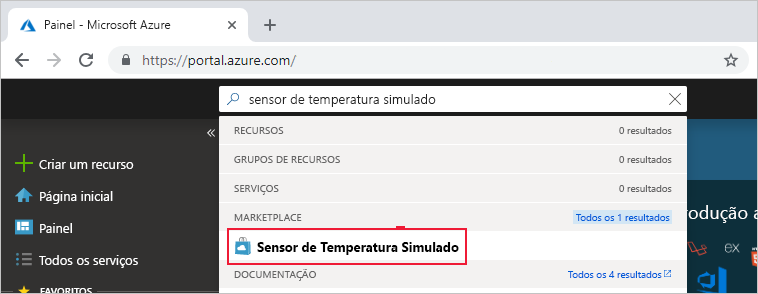

Um dos principais recursos do Azure IoT Edge é a possibilidade de implantar módulos em seus dispositivos IoT Edge na nuvem. Um módulo IoT Edge é um pacote executável implementado como contêiner. Nesta seção, implementaremos um módulo criado previamente na [seção Módulos do IoT Edge do Azure Marketplace](https://azuremarketplace.microsoft.com/en-us/marketplace/apps/category/internet-of-things?page=1&subcategories=iot-edge-modules). Este módulo gera uma telemetria para seu dispositivo simulado.

1. No portal do Azure, insira `Simulated Temperature Sensor` na pesquisa e abra o resultado do Marketplace.

   

2. No campo **Assinatura**, selecione a assinatura com o Hub IoT que você está usando se ainda não a selecionou.

3. No campo **Hub IoT**, selecione o nome do Hub IoT que você está usando se ainda não o selecionou.

4. Clique em **Localizar dispositivo**, selecione seu dispositivo IoT Edge (denominado `myEdgeDevice`), em seguida, selecione **Criar**.

5. Na etapa **Adicionar módulos** do assistente, clique no módulo **SimulatedTemperatureSensor** para verificar suas configurações, clique em **Salvar** e selecione **Próximo**.

6. Na etapa **Especificar rotas** do assistente, verifique se as rotas foram devidamente configuradas com a rota padrão que envia todas as mensagens de todos os módulos para o Hub IoT (`$upstream`). Caso contrário, adicione o código a seguir e selecione **Avançar**.

   ```json
    {
    "routes": {
        "route": "FROM /messages/* INTO $upstream"
        }
    }
   ```

7. No assistente, na etapa **Revisar implantação**, selecione **Enviar**.

8. Volte para a página de detalhes do dispositivo e selecione **Atualizar**. Além do módulo edgeAgent, criado quando você iniciou o serviço pela primeira vez, você poderá ver outro módulo de tempo de execução chamado **edgeHub** e o módulo **SimulatedTemperatureSensor** listados.

   Pode demorar alguns minutos até que os novos módulos apareçam. O dispositivo IoT Edge tem de recuperar suas novas informações de implantação da nuvem, iniciar os contêineres e depois relatar o novo status de volta ao Hub IoT. 

   
