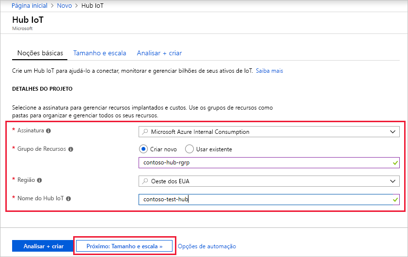

Esta seção descreve como criar um hub IoT usando o [portal do Azure](https://portal.azure.com).

1. Faça logon no [Portal do Azure](https://portal.azure.com). 

2. Escolha +**Criar um recurso**. Em seguida, *Pesquisar no Marketplace* o **Hub IoT**.

3. Selecione **Hub IoT** e clique no botão **Criar**. Você verá a primeira tela para a criação de um Hub IoT.

   

   Preencha os campos.

   **Assinatura**: selecione a assinatura a ser usada para o hub IoT.

   **Grupo de Recursos**: é possível criar um grupo de recursos ou usar um grupo existente. Para criar um novo, clique em **Criar novo** e preencha o nome que deseja usar. Para usar um grupo de recursos existente, clique em **Usar existente** e selecione o grupo de recursos na lista suspensa. Para obter mais informações, veja [Gerenciar grupos de recursos do Azure Resource Manager](../articles/azure-resource-manager/manage-resource-groups-portal.md).

   **Região**: é a região na qual você deseja que o hub esteja localizado. Selecione o local mais próximo de você na lista suspensa.

   **Nome do Hub IoT**: insira o nome do Hub IoT. Esse nome deve ser globalmente exclusivo. Caso o nome inserido esteja disponível, uma marca de seleção verde será exibida.

   [!INCLUDE [iot-hub-pii-note-naming-hub](iot-hub-pii-note-naming-hub.md)]

4. Clique em **Avançar: tamanho e escala** para continuar criando o hub IoT.

   

   Nesta tela, você pode usar os padrões e clicar em **Examinar + Criar** na parte inferior. 

   **Tipo e escala de preço**: É possível escolher entre várias camadas, dependendo de quantos recursos você quer e quantas mensagens você envia por dia através de sua solução. A camada gratuita destina-se a testes e avaliação. Ela permite que 500 dispositivos sejam conectados ao Hub IoT e até 8.000 mensagens por dia. Cada assinatura do Azure pode criar um Hub IoT na camada gratuita. 

   **Unidades do Hub IoT**: O número de mensagens permitidas por unidade ao dia depende do tipo de preço do seu hub. Por exemplo, se você quiser que o Hub IoT dê suporte à entrada de 700.000 mensagens, escolha duas unidades da camada S1.

   Para obter detalhes sobre as outras opções da camada, consulte [Escolher a camada certa do Hub IoT](../articles/iot-hub/iot-hub-scaling.md).

   **Avançado/partições de dispositivo para nuvem**: Essa propriedade está relacionada a mensagens de dispositivo para nuvem para o número de leitores simultâneos das mensagens. A maioria dos hubs IoT precisa apenas de quatro partições. 

5. Clique em **Revisar + criar** para examinar suas opções. Você verá algo semelhante a esta tela.

   

6. Clique em **Criar** para criar seu novo hub IoT. Criar o hub leva alguns minutos.
