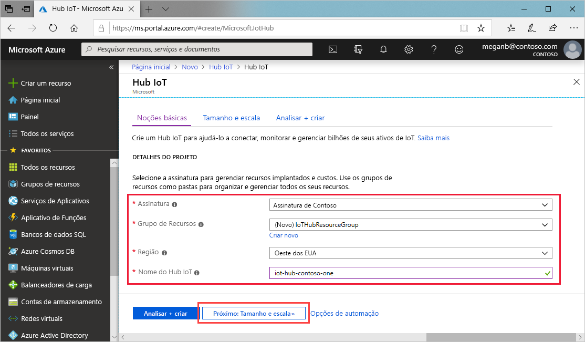

Esta seção descreve como criar um hub IoT usando o [portal do Azure](https://portal.azure.com).

1. Entre no [Portal do Azure](https://portal.azure.com).

1. Escolha **Criar um recurso** e, em seguida, insira *Hub IoT* no campo **Pesquisar** no Marketplace.

1. Selecione **Hub IoT** nos resultados da pesquisa e, em seguida, selecione **Criar**.

1. Na guia **Básico**, preencha os campos da seguinte maneira:

   - **Assinatura**: Selecione a assinatura a ser usada para o hub.

   - **Grupo de Recursos**: Selecione um grupo de recursos ou crie um novo. Para criar um novo, selecione **Criar novo** e preencha o nome que deseja usar. Para usar um grupo de recursos existente, selecione esse grupo de recursos. Para obter mais informações, veja [Gerenciar grupos de recursos do Azure Resource Manager](../articles/azure-resource-manager/manage-resource-groups-portal.md).

   - **Região**: Selecione a região na qual você deseja que o hub esteja localizado. Selecione a localização mais próxima de você.

   - **Nome do Hub IoT**: Digite um nome para o seu hub. Esse nome deve ser globalmente exclusivo. Caso o nome inserido esteja disponível, uma marca de seleção verde será exibida.

   [!INCLUDE [iot-hub-pii-note-naming-hub](iot-hub-pii-note-naming-hub.md)]

   

1. Selecione **Avançar: Tamanho e escala** para continuar criando o hub IoT.

   

    Esta tela permite que você defina os seguintes valores:

    - **Tipo e escala de preço**: Seu nível selecionado. É possível escolher entre várias camadas, dependendo de quantos recursos você quer e quantas mensagens você envia por dia usando sua solução. A camada gratuita destina-se a testes e avaliação. Ela permite que 500 dispositivos sejam conectados ao hub e até 8 mil mensagens por dia. Cada assinatura do Azure pode criar um Hub IoT na camada gratuita.

    - **Unidades do Hub IoT**: O número de mensagens permitidas por unidade ao dia depende do tipo de preço do seu hub. Por exemplo, se você quiser que o hub dê suporte à entrada de 700 mil mensagens, escolha duas unidades do nível S1.
    Para obter detalhes sobre as outras opções da camada, consulte [Escolher a camada certa do Hub IoT](../articles/iot-hub/iot-hub-scaling.md).

    - **Configurações avançadas** > **Partições de dispositivo para nuvem**: Essa propriedade está relacionada a mensagens de dispositivo para nuvem para o número de leitores simultâneos das mensagens. A maioria dos hubs precisa apenas de quatro partições.

1. Para este tutorial, aceite as opções padrão e, em seguida, selecione **Analisar + criar** para analisar suas escolhas. Você verá algo semelhante a esta tela.

   

1. Selecione **Criar** para criar o hub. Criar o hub leva alguns minutos.
