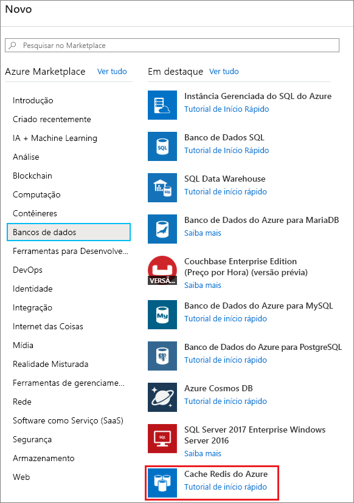

Para criar um cache, primeiro entre no [Portal do Azure](https://portal.azure.com) e clique em **Criar um recurso** > **Bancos de dados** > **Cache Redis**.

Em **Novo Cache Redis**, defina as configurações para o novo cache.

| Configuração      | Valor sugerido  | DESCRIÇÃO |
| ------------ |  ------- | -------------------------------------------------- |
| **Nome DNS** | Nome globalmente exclusivo | O nome de cache deve ser uma cadeia de caracteres com 1 a 63 caracteres e deve conter somente números, letras e o caractere `-` . O nome de cache não pode começar nem terminar com o caractere `-` e os caracteres `-` consecutivos não são válidos.  | 
| **Assinatura** | Sua assinatura | A assinatura na qual este novo Cache Redis do Azure foi criado. | 
| **Grupo de recursos** |  *TestResources* | Nome do novo grupo de recursos no qual criar o seu cache. Ao colocar todos os recursos para um aplicativo em um grupo, você pode gerenciá-los juntos. Por exemplo, excluir o grupo de recursos excluiria todos os recursos associados ao aplicativo. | 
| **Localidade** | Leste dos EUA | Escolha uma [região](https://azure.microsoft.com/regions/) perto de outros serviços que usarão o cache. |
| **[Tipo de preço](https://azure.microsoft.com/pricing/details/cache/)** |  C0 Básico (cache de 250 MB) |  O tipo de preço determina o tamanho, o desempenho e os recursos disponíveis para o cache. Para obter mais informações, confira [Visão geral do Cache Redis do Azure](../articles/redis-cache/cache-overview.md). |
| **Fixar no painel** |  Selecionado | Clique em Fixar o novo cache ao seu painel, facilitando a sua localização. |

 

Uma vez que as novas configurações de cache estiverem definidas, clique em **Criar**. 

Pode levar alguns minutos para que o cache seja criado. Para verificar o status, você pode monitorar o progresso no painel. Depois de o cache ter sido criado, seu novo cache terá um status **Executando** e estará pronto para uso.

