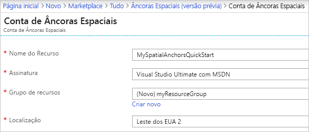
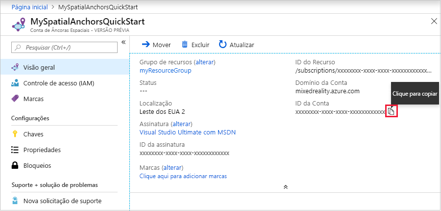
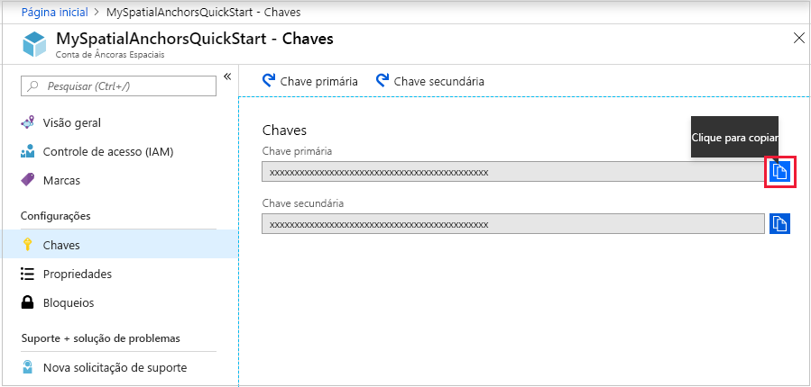

## Criar um recurso Âncoras Espaciais

1. Navegue até o <a href="https://portal.azure.com" target="_blank">Portal do Azure</a>.

2. No menu esquerdo do portal do Azure, selecione **Criar um recurso**.

3. Pesquise "Âncoras Espaciais" na barra de pesquisa.

   

4. Selecione **Âncoras Espaciais (versão prévia)** para abrir uma caixa de diálogo e selecione **Criar**.

5. No formulário **Conta de Âncoras Espaciais**:

   1. Especifique um nome de recurso exclusivo.
   2. Selecione a assinatura para anexar o recurso.
   3. Criar um grupo de recursos selecionando **Criar novo** e dê ao grupo de recursos o nome **myResourceGroup** e selecione **OK**.
      [!INCLUDE [resource group intro text](resource-group.md)]
   4. Selecione um local (região) em que o recurso será colocado.
   5. Selecione **Novo** para começar a criar o recurso.

   

6. Após a criação de recursos ser concluída com êxito, as propriedades do recurso poderão ser exibidas. Anote o valor da **ID da Conta** do recurso, uma vez que ele será necessário mais tarde.

   

7. Em **Configurações**, selecione **Chave** e anote o valor da **Chave primária**. Esse valor é o `Account Key` e será usado mais tarde.

   
