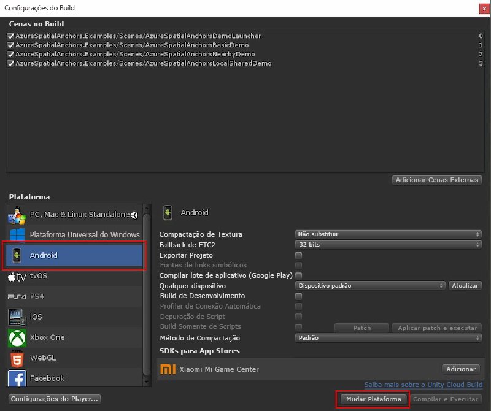

Abra o Unity e abra o projeto na pasta `Unity`.

Abra **Configurações de Build** selecionando **Arquivo** -> **Configurações de Build**.

Na seção **Plataforma**, selecione **Android**. Em seguida, altere o **Sistema de Build** para **Gradle** e verifique a opção **Exportar Projeto**.

Selecione **Mudar Plataforma** para alterar a plataforma para **Android**. O Unity pode solicitar que você instale os componentes de suporte do Android, se estiverem ausentes.

Feche a janela **Configurações de Build**.

### Baixar e importar o SDK do ARCore para Unity

Baixe o arquivo `unitypackage` de [SDK do ARCore para versões do Unity](https://github.com/google-ar/arcore-unity-sdk/releases/tag/v1.5.0). De volta no projeto do Unity, selecione **Ativos** -> **Importar Pacote** -> **Pacote Personalizado...** e, em seguida, selecione o arquivo `unitypackage` baixado anteriormente. Na caixa de diálogo **Importar Pacote do Unity**, verifique se todos os arquivos estão selecionados e, em seguida, selecione **Importar**.
